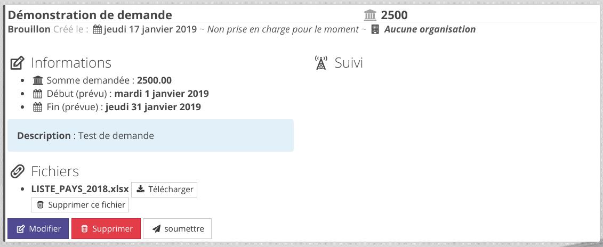

# Demande d'activités

Les **Demande d'activité** permettent à un utilisateur de rédiger une demande d'activité. Une fois la demande envoyée, un gestionnaire pourra accepter cette demande ou la refuser. Lorsqu'une demande est acceptée, Oscar va créer une nouvelle activité dans la base de données.

Cette fonctionnalité repose sur 2 privilèges : 

 - **Faire une demande d'activité** qui accorde à un rôle le droit de formuler une demande et de la soumettre
 - **Traiter les demandes d'activité** permet d'accepter ou refuser une demande

> Note : Le privilège **Administrer toutes les demandes d'activité** autorise un utilisateur à gérer toutes les demandes (supprimer définitivement, modifier l'état d'une demande)

## Demandeur

### Interface de suivi

Lorsque un utilisateur dispose du droit **demande d'activité**, il aura accès à l'interface de demande d'activité depuis le menu principal :

L'interface permet à l'utilisateur de faire le suivi des ces demandes. Par défaut, les demandes affichées sont les demandes en cours (Brouillon et Envoyée), mais il peut configurer l'interface pour voir l'historique de ces demandes (Validées, refusées).

### Nouvelle demande et modification

L'interface permet également de créer une nouvelle demande ou modifier les demande non-envoyées (Brouillon).

Les demandes sont mémorisées et conservées. Une fois la demande complétée, elle pourra être envoyée.

## Traitement des demandes

Les personnes disposant du privilège **Traiter les demandes** auront accès depuis l'écran d'accueil à l'interface de traitement des demandes : 

Le rejet d'une demande va clore la demande et notifier le demandeur du refus

L'étape de validation permet de choisir le rôle du demandeur dans l'activité qui sera créée.

> Les demandeurs associés à un organisme ajoutent à cette étape le choix du rôle de l'organisme référent.

Une fois la demande validée, une activité est créée dans l'application et pourra être gérée comme une activité normale.