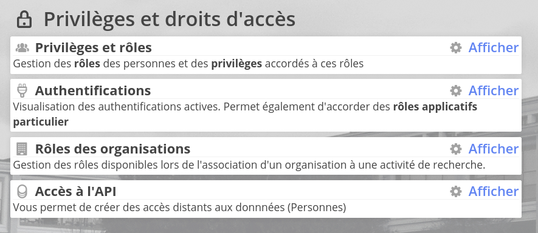
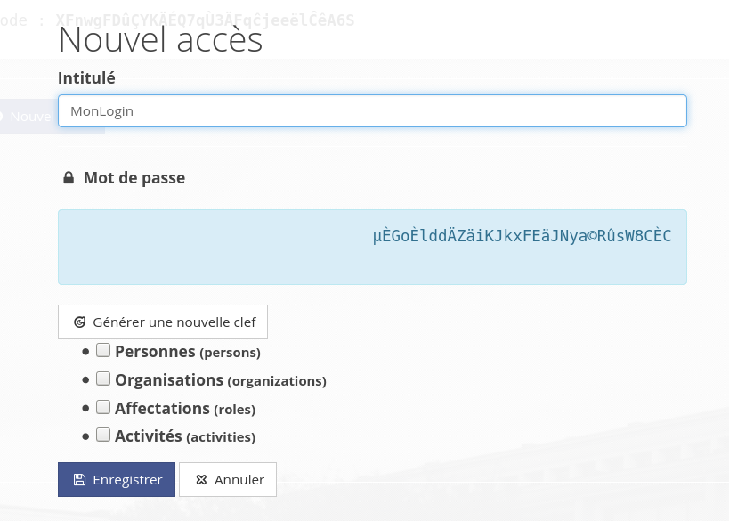

# Oscar API

Oscar dispose d'un API ouverte permettant d'interoger les données dans **Oscar** depuis une application tiers. 


## Accès à l'API

Pour activer cette fonctionnalité, vous devez vous rendre dans l'interface d'administration.



> Si l'option n'est pas disponible, vérifier votre version de Oscar (v2.11 "Macclane" minimum) et que vous disposer des privilèges suffisants

## Gérer les accès

L'inferface de gestion permet de voir les différentes clef d'accès disponibles dans Oscar : 


Cette interface permet de configurer les niveaux d'accès ainsi que les différents API disponibles.


 

## Accès

Les données seront accessibles via les URL : 


## Configurer les formatteurs

Les formatteurs permettent de personnaliser la sortie d'une ou plusieurs API.

Le formatteur de base est **\Oscar\Formatter\PersonToJsonConnectorBasicFormatter**, il produit une sortie au format JSON sous la forme : 

```json
{
  "version": "v2.11.1-macclane#dcf4a55e \u0022Macclaine\u0022 (2020-02-17 10:02:49)",
  "datecreated": "2020-02-17T12:04:44+01:00",
  "time": 0.00012345789,
  "total": 2,
  "persons": [
    {
      "uid": "6357",
      "login": "einstein",
      "firstname": "Albert",
      "lastname": "Einstein",
      "displayname": "Albert Einstein",
      "mail": "albert.einstein@berne-university.de",
      "affectation": "Bureau des brevets",
      "structure": "",
      "datecreated": "2015-11-05T15:33:08+01:00",
      "dateupdated": "2017-07-13T11:26:41+02:00",
      "datecached": "2017-07-13T11:26:41+02:00"
    },
    {
      "uid": "9038",
      "login": "tenseurman",
      "firstname": "Marcel",
      "lastname": "Grossmann",
      "displayname": "Marcel Grossmann",
      "mail": "marcel.grossmann@mathman.de",
      "affectation": "Berne University",
      "structure": "",
      "datecreated": "2016-07-07T16:48:13+02:00",
      "dateupdated": "2017-07-13T11:26:03+02:00",
      "datecached": "2017-07-13T11:26:03+02:00"
    }
  ]
}
```

Si besoin, vous pouvez développer vos propres formatteurs, des classes PHP qui assureront le traitement des données depuis Oscar vers le format de sortie souhaité.

**[A VENIR] Développer un formatteur pour l'API Oscar**


### Configurer les formatteurs disponibles

La première étape necessite d'identifier les formateurs disponible de la fichier de configuration générale : 

```php
<?php
// config/autoload/local.php
return array(
    'oscar' => [
        // ...
        'api' => [
           // Personnalisation des formats disponibles dans l'API (persons)
           'formats' => [
               'persons' => [
                   'ADAJ' => \Oscar\Formatter\FormatPersonToJSONExample::class,
                   'Basic' => \Oscar\Formatter\PersonToJsonConnectorBasicFormatter::class
               ]
           ]
       ],
    ]
);
```

Vous pourrez ensuite depuis l'interface de gestion des accès à l'API choisir parmi les formatteurs configurer celui à utiliser lors de l'accès à l'API.

## Évolutions prévues

 - [ ] API affectation
 - [ ] API activité
 - [ ] API feuille de temps
 - [x] Prise en charge de *formateur* personnalisés
 - [x] Configuration d'un *formatteur* pour les données

