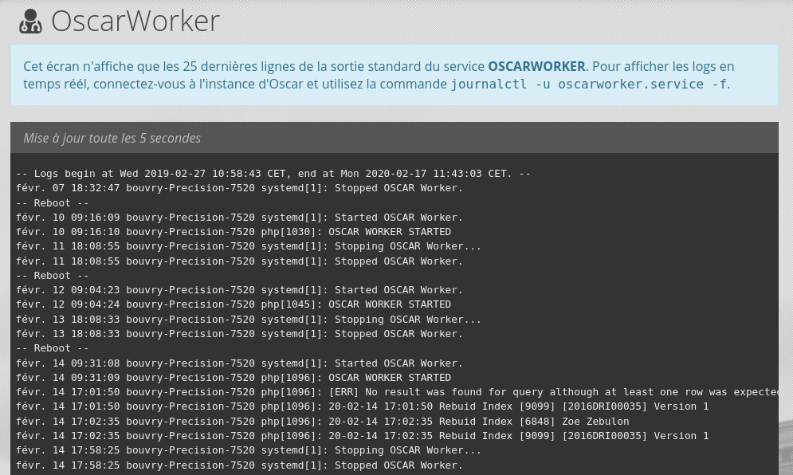

# Gearman

Le serveur Gearman permet de différer l'execution de certaines opérations couteuse. Il faut commencer par installer le serveur de JOB sur le système : 


## Installation du deamon

```bash
apt install gearman-job-server
```
 
Vous pouvez vérifier que le serveur est bien lancé avec la commande : 

```bash
systemctl status gearman-job-server
```
 
Résultat : 

```bash
● gearman-job-server.service - gearman job control server
   Loaded: loaded (/lib/systemd/system/gearman-job-server.service; enabled; vendor preset: enabled)
   Active: active (running) since Thu 2019-12-12 12:05:44 CET; 2min 23s ago
     Docs: http://gearman.info/
 Main PID: 16302 (gearmand)
    Tasks: 7 (limit: 4915)
   CGroup: /system.slice/gearman-job-server.service
            └─16302 /usr/sbin/gearmand --pid-file=/run/gearman/gearmand.pid --listen=localhost -daemon --log-file=/var/log/gearman-job-server/gearmand.log

déc. 12 12:05:44 bouvry-Precision-7520 systemd[1]: Starting gearman job control server...
déc. 12 12:05:44 bouvry-Precision-7520 systemd[1]: Started gearman job control server.
```

## Installation du client PHP

On installe ensuite le **module Gearman de PHP** : 

```bash
# Installation du module Gearman PHP
apt install php7.3-gearman
```

Par défaut, l'extension *Gearman* n'est pas activée dans le `php.ini`. Éditez les fichier **/etc/php/7.3/cli/php.ini** et **/etc/php/7.3/apache2/php.ini** en ajoutant la ligne : 

```ini
; /etc/php/7.3/apache2php.ini - /etc/php/7.3/apache2php.ini
extension=gearman
```

## Installation du *Worker* PHP

Une fois le serveur **Gearman** et le **module Gearman PHP** installés, on installe le service Oscar chargé de traiter les tâches en attente.

```bash
# on copie le gabarit de configuration du service
cp install/oscarworker.dist.service config/oscarworker.service

# On édite le service
nano config/oscarworker.service
```

> Dans le fichier `config/oscarworker.service`, vous devez simplement indiquer le chemin complet vers le fichier PHP **bin/oscarworker.php**.

On va ensuite ajouter le *worker oscar* au service du système.

```bash
# On va dans le dossier des service
cd /etc/systemd/system

# On ajoute la configuration du service dans SYSTEMD avec un lien symbolique
ln -s /var/OscarApp/oscar/config/oscarworker.service oscarworker.service

# On active le service
systemctl enable oscarworker.service
# Ancienne syntaxe avec SYSTEM : service enable oscarworker


# On lance le service
systemctl start oscarworker
# ANCIENNE SYNTAXE : service oscarworker start
```

```bash
# Voir la liste des services
systemctl list-units --type=service

```


Vous pouvez surveiller le *Worker Oscar* avec la commande : 

```bash
# On regarde si tout est OK
journalctl -u oscarworker.service -f
```

A cette étape, le serveur Gearman est opérationnnel et le Worker Oscar est installé.

## Contôler le worker depuis Oscar


La commande `php bin/oscar.php check:config` inclus un test de la communication entre Oscar et le serveur Gearman, ainsi qu'un test de retour du Worker. La commande indiquera si le problème vient du serveur Gearman ou du Worker.

```bash
php bin/oscar.php check:config
```

Vous pouvez également vérifier l'état du worker depuis l'interface depuis le menu **Administration>Maintenance>Status OSCARWORKER** : 


Vous disposerez d'un écran de contrôle pour vous assurer que *OscarWorker* est bien actif : 



## Modifier l'URL du serveur de job Gearman

Oscar permet si besoin de modifier l'URL du serveur GEARMAN, pour cela, ajouter dans la configuration Oscar `config/autoload/local.php` une clef **gearman-job-server-host** dans la section **oscar** : 

```php
<?php
return [
    // ...
    'oscar' => [
        // Paramètre utilisé en PHP avec la méthode addServer(<ICI>)
        'gearman-job-server-host' => 'localhost'
    ]
];
```

      