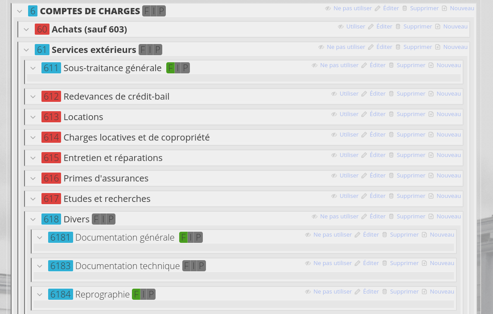
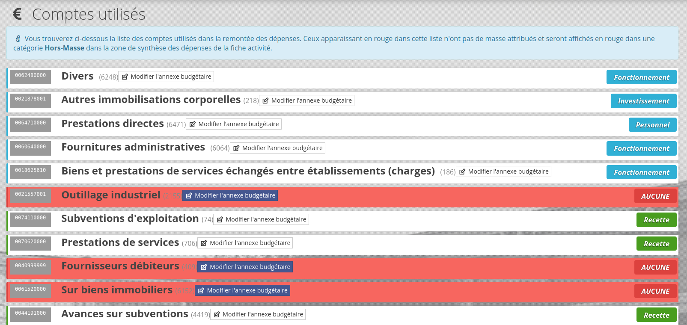

# Affichage des dépenses (SIFAC)

Oscar permet de synchroniser depuis le SI(Système d'Information) **les dépenses** effectuées dans le cadre des activités de recherche. Cette synchronisation s'appuie sur le journal des pièces de SIFAC.

> Vous pouvez gérer les accès à cette fonctionnalité depuis la gestion des privilèges.

## SIFAC

Pour activer l'affichage des dépenses, vous devez accorder le privilèges **Voir les dépenses**, configurer les masses et le plan comptable par défaut.


### Configurer les masses

Vous devez commencer par spécifier les masses dans la configuration `config/autoload/local.php`. La configuration ci dessous est celle généralement utilisée.

```php
<?php
// config/autoload/local.php
return array(
    // ...
    'oscar' => [
        // ...
        // Masses
        'spenttypeannexes' => [
            "F" => "Fonctionnement",
            "I" => "Investissement",
            "P" => "Personnel"
        ],
    ]
);
```


### Plan comptable initial

Vous allez devoir préciser le plan comptable à utiliser. Complétez la configuration dans  `config/autoload/local.php` avec la clef **spenttypesource** pour indiquer le fichier contenant le plan comptable général officiel (le chemin de l'exemple est un plan valide).

```php
<?php
// config/autoload/local.php
return array(
    // ...
    'oscar' => [
        // ...
        // Emplacement du plan comptable par défaut
        'spenttypesource' => dirname(__DIR__).'/../install/plan-comptable.csv',
    ]
);
```

Vous pourrez ensuite vous rendre dans l'interface d'administration pour charger le plan comptable général en cliquant sur le bouton **Charger le Plan Comptable Général**.

Puis, Vous pourrez ensuite compléter ce plan et spécifier les codes à utiliser ou pas ainsi que leur attribution dans les différentes masses configurées préalablement. 



Ce plan sera utilisé par la suite pour renseigner les dépenses prévisionnelles.

### Gestion des masses utilisée

Dans la partie **Administration > Types de dépenses > Gérer les masses des comptes utilisés**, un écran permet de visualiser les comptes dont l'utilisation est effective (Des lignes comptables ont été chargées pour des activités)



Cet écran permet : 
 - En cliquant sur le numéro de compte (à gauche) d'afficher les activités qui ont des dépenses liées à ce compte
 - De modifier la masse associées à un compte
 - D'identifier les comptes non-affectés à une masse budgétaire (les lignes rouges)

### Connector SIFAC (OCI)

Le premier connecteur disponible est une connection directe à la base de donnée.

SIFAC utilise une base de donnée ORACLE, il faudra donc installer les drivers OCI8 pour PHP pour permettre la connection à la base de données SIFAC. [Installer le drivers OCI8 pour PHP](../install-oracle.md).


### Configuration de l'accès à la base de données SIFAC

Les informations de connection doivent être renseignées dans le fichier de configuration Oscar `config/autoload/local.php` : 

```php
<?php
// config/autoload/local.php
return array(
    // ...
    'oscar' => [
        // ...
        'connectors' => [
            // ...
            'spent' => [
                'sifac' => [
                    'class'     => \Oscar\Connector\ConnectorSpentSifacOCI::class,
                    'params'    => [
                        'username'  => '<SIFAC_DB_USER>',
                        'password'  => '<SIFAC_DB_PASS>',
                        'SID'  => '<SIFAC_DB_SID>',
                        'port'      => '<SIFAC_DB_PORT>',
                        'hostname'  =>'<SIFAC_DB_HOST>',
                        'spent_query' => \Oscar\Connector\ConnectorSpentSifacOCI::SPENT_QUERY
                    ]
                ]
            ]
         ],
    ]
);
```

Une fois l'accès configuré, vous pourrez, depuis la fiche activité, accéder à l'écran de visualisation des dépenses pour charger les dépenses depuis SIFAC. **Les dépenses s'appuient sur le PFI uniquement**.

La liste des dépenses s'appuis sur le plan comptable pour gérer certains intitulés, si ce dernier est manquant ou incomplet, certaines informations peuvent être manquantes ou érronées.

### Exclure certains comptes des résultats depuis Oscar

Depuis le menu **Administration>Configuration et maintenance>Options>Comptes filtrés**.


Cette option va exclure certains résultats.

### Personnaliser la requète des dépenses

Dans la configuration de l'accès SIFAC, vous pouvez personnaliser/adapter la requète de chargement des données. La requête initiale est formalisée ainsi par défaut : 

```sql
select  
    MEASURE AS pfi,  
    RLDNR as AB9, 
    STUNR as idsync,  
    awref AS numSifac, 
    vrefbn as numCommandeAff, 
    vobelnr as numPiece, 
    LIFNR as numFournisseur, 
    KNBELNR as pieceRef, 
    fikrs AS codeSociete, 
    BLART AS codeServiceFait, 
    FAREA AS codeDomaineFonct, 
    sgtxt AS designation, 
    BKTXT as texteFacture, 
    wrttp as typeDocument, 
    TRBTR as montant, 
    fistl as centreDeProfit, 
    fipex as compteBudgetaire, 
    prctr AS centreFinancier, 
    HKONT AS compteGeneral, 
    budat as datePiece, 
    bldat as dateComptable, 
    gjahr as dateAnneeExercice, 
    zhldt AS datePaiement,  
    PSOBT AS dateServiceFait 
from sapsr3.v_fmifi 
where 
    measure = '%s' 
    AND rldnr='9A' 
    AND MANDT='430' 
    AND BTART='0250'
```

Il est possible qu'il faille modifier la clause `MANDT='430'` qui correspond à SIFAC formation.

### Utilitaire en ligne de commande

La commande Oscar **php bin/oscar.php** propose différentes commandes permettant de gérer / tester les données lièes au dépenses. Vous pouvez tester la synchronisation SIFAC depuis l'interface, mais également en utilisant la console en lançant la synchronisation des dépenses d'une activité de recherche avec la commande : 

```bash
php bin/oscar.php spent:sync <PFI>
```

> Vous pouvez voir la liste des commandes liées aux dépenses dans la [Documentation des commandes](../commands/liste_des_commandes.md))
