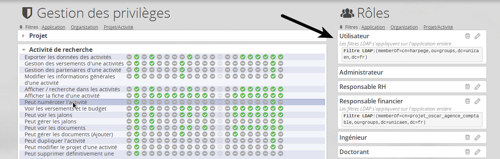
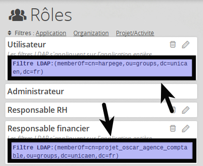

# Données

*Oscar* dispose de mécanismes pour gérer et synchroniser les données tiers.

Il propose des utilitaires en ligne de commande pour **importer des données** depuis un fichier, et un mécanisme pour **synchroniser** des informations depuis une source tiers (les *connectors*).


## Principe de Connectors

Les connectors permettent de *brancher* Oscar sur des sources de données et d'automatiser la maintenance de ces données.

Les connectors dans version 2.0 d'Oscar s'appuient sur un service REST distant qui va livrer les données à Oscar sous un format standardisé.

Oscar possède la possibilité de se connecter via une connexion ssl en relation avec un certificat .p12 avec mdp, il faudra cependant le préparer en le scindant en deux fichiers (certificat et clef)

Une note pour scinder ce type de certificat sous environnement linux via openssl est expliqué plus bas dans ce chapitre dans la section dédiée aux développeurs.

Il est possible de développer ces propres services si les informations sont réparties de façon plus spécifique dans le SI.


## Connector PERSONS

Données utilisées dans l'application pour les personnes qui participent aux activités de recherche.

Note : Attention, dans Oscar, les comptes pour s'authentifier et les personnes sont des données distinctes, une personne peut être présente dans Oscar sans pour autant avoir de compte pour s'authentifier dessus. Par contre, il existe une relation facultative entre les personnes et les authentifications. Cette relation est établie côté Oscar via les champs **ldapLogin** dans **Person** et **username** dans **Authentification**.

La configuration suivante dans le fichier `/config/autoload/local.php` permet d'activer le connecteur REST pour les personnes.

```php
// /config/autoload/local.php
<?php
return array(
 // ...
  'oscar' => [
    'connectors' => [
      'person' => [
        'rest' => [
          'class'     => \Oscar\Connector\ConnectorPersonREST::class,
          'params'    => APP_DIR . '/config/connectors/person_rest.yml',
          'editable'  => false
        ]
      ]
    ]
  ]
);
```

Si votre copie de Oscar n'utilise pas les connectors pour synchroniser des données, vous devez renseigner les différents connectors avec des tableaux vides : 

```php
<?php
return array(
    'oscar' => [
        'connectors' => [
            'organization' => [],
            'person' => []
        ],
    ]
);
```

Pour information, la clef `class` permet de choisir une classe à utiliser pour traiter les données. Cette class implémente l'interface `IConnectorPerson`, il est possible d'implémenter vos propres connectors si besoin.

le fichier `/config/connectors/person_rest.yml` contient les URL utilisées par le connecteur pour obtenir les données :

```yml
# Emplacement du service REST fournissant la liste des personnes
url_persons: 'https://rest.service.tdl/api/persons'

# Emplacement du service REST fournissant les données pour une personne
# Noter la présente du '%s' que Oscar remplacera par l'UID utilisé dans
# le service REST.
url_person: 'https://rest.service.tld/api/person/%s'
```

Dans le cadre d'une connexion vers une api avec certificat il faudra compléter les éléments suivants avec vos informations

Ajouter et, ou compléter la clef acces_strategy avec le path vers la class dédié à la connexion avec certificat

Compléter les path(s) vers vos fichiers :certificat et clef de certificat, ainsi que le mot de pass pour ces éléments

```yml
# Emplacement du service REST fournissant la liste des personnes
# ...
# ...
# Accès spécifique
access_strategy:  Oscar\Connector\Access\ConnectorAccessCurlCertificat
# Clef certificat .pem
file_certificat_ssl_key: config/connectors/key.pem
# Client certificat .pem
file_certificat_cert: config/connectors/client.pem
# Pass certificat .pem
file_certificat_pass: VOTREPASSCERTIFICAT
```


Les URL correspondent à l'API REST qui devra retourner un JSON standard, pour la liste un tableau d'objet, pour l'accès unitaire un objet simple sous la forme :

**Remarque** : Depuis la version *2.7 "Lewis"*, Oscar accepte un objet contenant une clef `persons` contenant le tableau d'objet afin de simplifier sa synchronisation avec les outils tel que **Talend ESB**.


```JSON
{
   "uid": "p00000237*",
   "login": "sbouvry",
   "firstname": "Stéphane",
   "lastname": "Bouvry",
   "displayname": "Stéphane Bouvry",
   "mail": "sbouvry@domain.tdl",
   "civilite": "Mr",
   "preferedlanguage": "fr",
   "status": "CONTRACTUEL",
   "affectation": "LABO LAB",
   "structure": "UFR de Science",
   "inm": "237",
   "phone": "0231237237",
   "birthday": "YYYY-MM-DD",
   "datefininscription": "YYYY-MM-DD",
   "datecreated": "YYYY-MM-DD",
   "dateupdated": "YYYY-MM-DD",
   "datecached": "YYYY-MM-DD",
   "address": {
      "address1" : "1, place du centre",
      "address2" : "bâtiment B",
      "address3" : "BP 237",
      "zipcode" : "14021",
      "city": "Caen",
      "country": "France"
   },
   "groups": [
      "cn=mongroupe,ou=groups,dc=domain,dc=fr"
   ],
   "roles": {
      "CODE STRUCTURE": ["Role1", "Role2", "RoleN"]
   }
}
```

Voici les données minimales attendues :
(les valeurs terminées par un \* sont obligatoires)

```JSON
{
   "uid": "ID UNIQUE",
   "login": "Identifiant utilisé pour l'authentification LDAP (supannAliasLogin) * ",
   "firstname": "Prénom * ",
   "lastname": "Nom * ",
   "displayname": "Tel que affiché * ",
   "mail": "Courriel de la personne (unique) * ",
   "civilite": "",
   "preferedlanguage": "",
   "status": "",
   "affectation": "",
   "structure": "",
   "inm": "",
   "phone": "",
   "birthday": "",
   "datefininscription": "",
   "datecreated": "",
   "dateupdated": "YYYY-MM-DD",
   "datecached": "YYYY-MM-DD",
   "address": null,
   "groups": [],
   "roles": {}
}
```

Important : Oscar gère l'authentification séparément, il établit la jonction entre
la Personne (donnée) et l'authentification en utilisant la valeur présente dans login
qui doit correspondre au champ username, cette valeur provient généralement du champ **supannAliasLogin** côté LDAP.

Pour l'URL "liste", le service REST doit retourner un tableau composé d'objets organisés de la même façon.

```JSON
[
  {  
    "uid": "person1",
    "login": "etc..." 
  },
  {
    "uid": "person2",
   "login": "etc..." 
  },
  { 
    "uid": "person3",
    "login": "etc..." 
  }
]
```

ou

```JSON
{ 
  "persons" : [
      {  
        "uid": "person1",
        "login": "etc..." 
      },
      {
        "uid": "person2",
       "login": "etc..." 
      },
      { 
        "uid": "person3",
        "login": "etc..." 
      }
  ]
}
```

### Clef ROLES

Cette clef permet d'affecter automatiquement une personne (**Person**) à une organisation (**Organization**) avec un ou plusieurs rôles.

Elle se présente sous cette forme : 
```json
{
  "roles": {
    "STRUCTUREA": ["Responsable financier", "Responsable RH"],
    "STRUCTUREB": ["Responsable RH"]
  }
}
```

La clef rôle est un objet composé de clef, une clef pour chaque structure. Dans cet exemple, il y'a 2 structures identifiées ayant pour **Code de structure** : *STRUCTUREA* et *STRUCTUREB* (ces codes correspondent aux valeur du champ **code** dans le connecteur des organisations - voir plus bas).

La valeur de chaque clef *structure* est un tableau de chaîne de caractères contenant le rôle tel que défini dans Oscar.

La liste des rôles est disponible en base de données dans la table **user_role** ou via l'interface avec le menu `Administration > Gestion des droits`




### La clef GROUPS

Cette clef est liée à la gestion des rôles. En effet, un rôle peut être défini avec un filtre *Ldap*. Dans l'exemple ci dessous, les rôles **utilisateur** et **responsable financier** ont des filtres LDAP.



Si un utilisateur se connecte à Oscar, et qu'il appartient a un rôle correspondant côté LDAP(généralement, le champ **memberOf** dans un LDAP supann), il va endosser automatiquement dans oscar ce rôle **sur la totalité de l'application** (toutes les activités).

## Connector ORGANIZATIONS

De la même façon, 2 URL peuvent être utilisées pour synchroniser les données des structures. Voici le modèle attendu :

```json
{
    "uid" : "ID UNIQUE (utilisé par oscar pour synchroniser)",
    "code" : "CODE UNIQUE (utiliser pour les affectations des personnes)",
    "shortname" : "ex : ANR",
    "longname" : "ex : Agence Nationale de la Recherche",
    "description" : "",
    "address" : {
      "address1" : " address peut être NULL",
      "address2" : "",
      "address3" : "Boîte postale",
      "zipcode" : "",
      "city": "",
      "country": ""
    },
    "dateupdated" : "YYYY-MM-DD utilisé pour appliquer ou pas l'update",
    "phone" : "",
    "url" : "",
    "email" : "",
    "siret" : "",
    "type": "Type d'organisation tel que configuré dans Oscar",
    "labintel": ""
}
```

Données minimales attendues :

```json
{
    "uid" : "ID UNIQUE",
    "code" : "CODE UNIQUE (utiliser pour les affectations des personnes)",
    "shortname" : "ex : ANR",
    "longname" : "ex : Agence Nationale de la Recherche",
    "description" : "",
    "address" : null,
    "dateupdated" : "YYYY-MM-DD",
    "phone" : "",
    "url" : "",
    "email" : "",
    "siret" : ""
}
```

> Conernant le CODE. Le champs CODE permet dans la version actuelle d'établir la liaison entre une personne et une organisation. Dans les prochaines versions, cette liaison sera probablement découplée du reste (un nouveau connecteur sera dédié à gérer cette relation) et utilisera l'UID plutôt que le code.

Forme attendue : 

```JSON
[
    {  
        "uid" : "ED209",
        "code" : "ED209",
        "shortname" : "OCP",
        "longname" : "Omni Consumer Product",
        "dateupdated" : "etc..."
    },
    {
        "uid": "ORG2",
        "code": "ORG2 etc ..." 
    },
    { 
        "uid": "ORG3",
        "code": "ORG3 etc ..." 
    }
]
``` 

**Remarque** : Depuis la version *2.7 "Lewis"*, Oscar accepte un objet contenant une clef `organizations` contenant le tableau d'objet afin de simplifier sa synchronisation avec les outils tel que **Talend ESB**.

```JSON
{ 
  "organization" : [
      {  
        "uid" : "ED209",
        "code" : "ED209",
        "shortname" : "OCP",
        "longname" : "Omni Consumer Product",
        "dateupdated" : "etc..."
      },
      {
        "uid": "ORG2",
        "code": "ORG2 etc ..." 
      },
      { 
        "uid": "ORG3",
        "code": "ORG3 etc ..." 
      }
  ]
}
``` 


## Importer des activités (Installation initiale)

Oscar dispose d'un utilitaire en ligne de commande pour importer des activités depuis un fichier CSV ou JSON.

Son fonctionnement est détaillé ici : [Importer des activités dans Oscar](./activity-import.md)


### Executer les connecteurs

Une fois les connecteurs configurés, vous pouvez lancer la synchronisation des données depuis l'interface ou utiliser (recommandé) l'utilitaire en ligne de commande en éxecutant la commande :

```bash
php bin/oscar.php persons:sync rest
```

Cela va éxecuter la synchronisation des personnes en utilisant le connecteur REST.

## Connection avec certificat

Configuration des connecteurs OSCAR (Persons/Organizations) avec Certificat SSL

Pour rappel vous devez disposer des deux fichiers correspondant au traitement d'un certificat généré .p12 et scinder via un outil tel que openssl (commande ci-dessous sous environnement linux).

```bash
openssl pkcs12 -in nomDeVotreCertificat.p12 -out client.pem -clcerts -nokeys 
openssl pkcs12 -in nomDeVotreCertificat.p12 -out key.pem -nocerts
```

Le mot de passe de votre certificat vous sera demandé, ce mot de passe correspond à celui que vous devez remplir dans le fichier de config (voir début de page de documentation)

Il est possible de tester votre connecteur avec certificat en utilisant la commande dédiée :

Pour soumettre à une api en rest en utilisant un paramètre UID pour exemple.

```bash
php bin/oscar.php dev:commandtestsslsyncpersons rest https://referentiel-xx-xx.domaine.fr/api_oscarxxxx/person votreUIDpourexemple
```
Le paramètre UID est en option, pour exemple vous pouvez récupérer une collection selon api

```bash
php bin/oscar.php dev:commandtestsslsyncpersons rest https://referentiel-xx-xx.domaine.fr/api_oscarxxxxx/persons
```

Puis dans le fichier `person_rest.yml` ou `organizations_rest.yml`, compléter la configuration en indiquant l'emplacement des certificats : 

```yaml
# Emplacement du service REST fournissant la liste des personnes
url_persons: 'https://api.domain.ext/person/'

# Emplacement du service REST fournissant les données pour une personne
# Noter la présente du '%s' que Oscar remplacera par l'UID utilisé dans
# le service REST.
url_person: 'https://api.domain.ext/person/%s'

# Accès SSL (Certificat)
access_strategy:  Oscar\Connector\Access\ConnectorAccessCurlCertificat

# Clef certificat .pem
file_certificat_ssl_key: config/connectors/key.pem

# Client certificat .pem
file_certificat_cert: config/connectors/client.pem

# Pass certificat .pem
file_certificat_pass: VOTREPASSCERTIFICAT
```


## NOTE DEVELOPEUR

### Connecteur PERSON

#### Rappel

Classe : `module/Oscar/Connector/ConnectorPersonREST`

La configuration du connecteur est spécifier dans le fichier de configuration `config/autoload/local.php`, elle précise la classe utilisée pour réaliser la synchronisation des personnes, ainsi que le fichier de configuration Yaml associé/  

```php
// /config/autoload/local.php
<?php
return array(
 // ...
  'oscar' => [
    'connectors' => [
      'person' => [
        'rest' => [
          // C'est ICI que l'on indique la classe chargée réaliser la synchronisation
          'class'     => \Oscar\Connector\ConnectorPersonREST::class,

          'params'    => APP_DIR . '/config/connectors/person_rest.yml',
          'editable'  => false
        ]
      ]
    ]
  ]
);
```

Par défaut, le fichier YAML contient 2 URLs, l'une pour la synchronisation complète, l'autre pour la synchonisation unitaire.

```yaml
# Emplacement du service REST fournissant la liste des personnes
url_persons: 'https://rest.service.tdl/api/persons'

# Emplacement du service REST fournissant les données pour une personne
# Noter la présente du '%s' que Oscar remplacera par l'UID utilisé dans
# le service REST.
url_person: 'https://rest.service.tld/api/person/%s'
```

#### Connector Access

Si besoin d'un système d'accès spécifique, il est possible de réécrire une classe d'accès qui implémente l'interface `IConnectorAccess`

Exemple : 

```php
// module/Oscar/src/Oscar/Connector/Access/ConnectorAccessFile.php
<?php
namespace Oscar\Connector\Access;

use Oscar\Connector\IConnector;
use Oscar\Exception\ConnectorException;
use Oscar\Utils\PhpPolyfill;

/**
 * FICHIER d'EXEMPLE
 * Class ConnectorAccessFile
 * @package Oscar\Connector\Access
 */
class ConnectorAccessFile implements IConnectorAccess
{
    /** @var IConnector */
    private $connector;

    /** @var string */
    private $filepath;

    private const FILE_PATH_PARAMETER_NAME = 'file_data';

    /**
     * ConnectorAccessCurlHttp constructor.
     * @param IConnector $connector Connector qui va consommer l'accès aux données.
     * @param string $url Nom du paramètre contenant d'URL.
     */
    public function __construct(IConnector $connector, $options)
    {
        $this->connector = $connector;
    }

    public function getDatas()
    {
        if( !$this->connector->hasParameter(self::FILE_PATH_PARAMETER_NAME) ){
            throw new ConnectorException("Le paramètre '%s' est requis.", self::FILE_PATH_PARAMETER_NAME);
        }

        $file = $this->connector->getParameter(self::FILE_PATH_PARAMETER_NAME);
        if( !file_exists($file) ){
            throw new ConnectorException("Le fichier '%s' n'existe pas.", $file);
        }

        $datas = file_get_contents($file);
        
        return PhpPolyfill::jsonDecode($datas);
    }
}
```
On peut ensuite configurer l'accès dans le fichier YAML avec le paramètre `access_strategy`, et préciser l'emplacement du fichier avec le paramètre idoine `file_data` : 

```yaml
# On laisse les URLs même si elles ne sont pas utilisées
url_persons: 'https://rest.service.tdl/api/persons'
url_person: 'https://rest.service.tld/api/person/%s'

# Accès spécifique
access_strategy:  Oscar\Connector\Access\ConnectorAccessFile
file_data: /path/to/persons.json
```