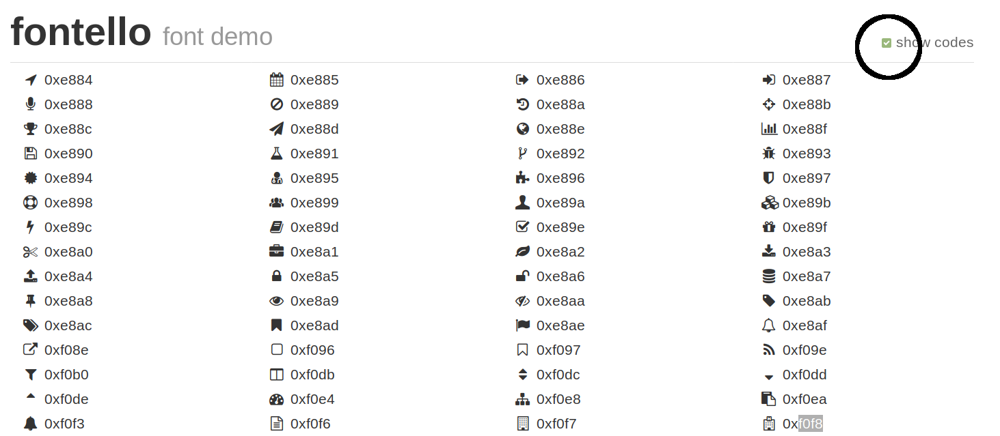

# Personnalisation visuel

## Modification visuels

*Oscar* permet de modifier votre instance en utilisant un fichier CSS complémentaire.

Pour cela, créez un fichier dans le dossier `public/custom/custom.css` :

```bash
touch public/custom/custom.css
```

Par exemple :

```css
html body {
    background: #ff6600 !important;
}
```


# Ajouter des pictogrammes pour les types d'organisation

Lorsque vous ajoutez des types d'ogranisation, ils n'ont par défaut pas d'icône associé. Vous pouvez compléter les régles de mise en forme CSS dans le fichier `custom.css` : 

```css
/** Exemple pour un type 'Corporation' **/
.organization.type-corporation h2::before {
    content: '\f0f8'
}
```

Le `content` attends une valeur correpondant au code icône disponible dans la bibliothèque d'icône disponible dans Oscar (public/css/fontello/demo.html), notez que dans le CSS, le préfixe `0x` est remplacé par un slash : 



> Lorsque vous créez un type avec des mots composés, Oscar utilise un mécanisme de *slugification* pour générer les classes CSS, il substitue les caractères accentués par leur équivalent sans accent et remplace des espaces/ponctuations par des tirets. Par exemple le type **société écran** deviendra `societe-ecran`. Vous pouvez inspecter le code source dans la fiche/liste pour voir la classe CSS générée par Oscar.