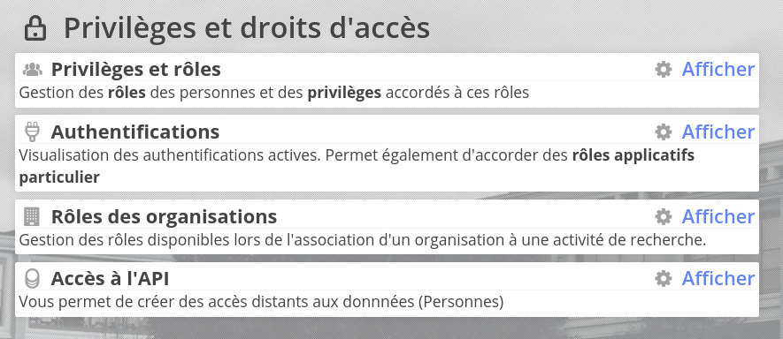
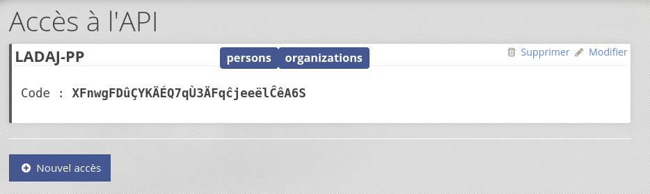
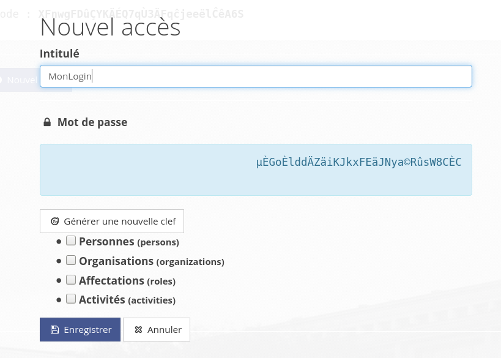

# Oscar API

Oscar dispose d'un API ouverte permettant d'interoger les données dans **Oscar** depuis une application tiers. 

## Accès à l'API

Pour activer cette fonctionnalité, vous devez vous rendre dans l'interface d'administration.

> Si l'option n'est pas disponible, vérifier votre version de Oscar (v2.11 "Macclane" minimum) et que vous disposer des privilèges suffisants

## Gérer les accès

L'inferface de gestion permet de voir les différentes clef d'accès disponibles dans Oscar : 

Cette interface permet de configurer les niveaux d'accès ainsi que les différents API disponibles.

 

## Accès

Les données seront accessibles via les URL : 

## Évolutions prévues

 - [ ] API affectation
 - [ ] API activité
 - [ ] API feuille de temps
 - [ ] Prise en charge de *formateur* personnalisés
 - [ ] Configuration d'un *formatteur* pour les données

