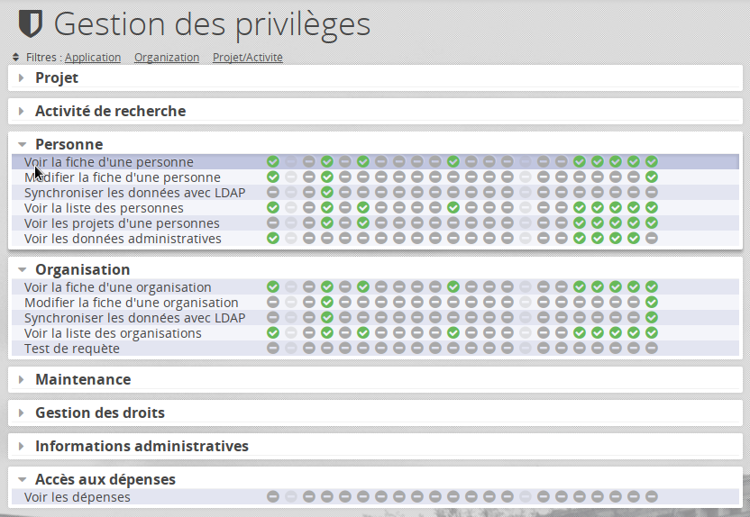

# Privilèges

## Présentation

Les privilèges permettent d'accorder à un rôle précis l'accès à une fonctionnalité. L'interface pour les gérer est disponible dans le menu `Administration > Gestion des droits`



La gestion des privilèges est gérée en base de données via les tables : 

 - **privilege**, qui liste les privilèges disponibles
 - **categorie_privilege** qui permet d'organiser ces privilèges en catégorie
 - **role_privilege** qui permet d'affecter un privilège à un rôle
 
## Mise à jour

Lorsque qu'une nouvelle fonctionnalité implique un nouveau privilège, il n'est pas présent dans la table privilège, la fonctionnalité n'est donc pas disponible dans l'interface.

Pour ajouter ce privilège, il faut **mettre à jour les données de la table privilege**.

Une procédure automatique existe pour effectuer la mise à jour des privilèges.

1. Se connecter à la machine Oscar en SSH
2. Se rendre à la racine de oscar
3. Taper la commande `php bin/oscar.php patch checkPrivilegesJSON`

L'invite en ligne de commande vous indiquera les opérations qui seront réalisées

### Note

La liste des privilèges utilisées dans l'application est présente dans le fichier `ìnstall/privileges.json`.

### Erreur connue

Il est possible (si les privilèges ont été gérés manuellement), que l'indexation postgesql ne soit pas à jour. Pour le vérifier, se connecter à la base de données posgresql : 

```bash
psql -h <url du serveur postgresl> -U <utilisateur> <base de donnée>
```

On commence par afficher le plus grand ID de la table privilege : 

```sql
SELECT MAX(id) FROM privilege;
```

Ensuite on vérifie que la sequence est à jour, elle doit retourner une valeur supérieur à celle obtenue avec la requête précédente.

```sql
SELECT last_value FROM privilege_id_seq;
```

Si ça n'est pas le cas, il faut mettre à jour la sequence avec cette requête, dans cet exemple le `XX` correspond à la valeur du dernier ID incrémenté de 1 : 

```sql
ALTER SEQUENCE privilege_id_seq RESTART WITH XX;
```

## Coin des développeurs

### Ajouter un privilège

La gestion des accès est gérée à 2 endroits : 

 - Le fichier de configuration oscar *module/Oscar/config/module.config.php* qui va gérer les *gardes* (Fonctionnalité Bjyauthorise étendue par UnicaenAuth)
 - La base de données
 
Commencez par ajouter le privilege dans les constantes du fichier `module/Oscar/src/Oscar/Provider/Privileges.php`

La forme qu'il prend est normalisée : `CODECATEGORIE_CODEPRIVILEGE`

```php
<?php
// module/Oscar/src/Oscar/Provider/Privileges.php 
namespace Oscar\Provider;
class Privileges extends \UnicaenAuth\Provider\Privilege\Privileges
{
    const CODECATEGORIE_CODEPRIVILEGE = 'CODECATEGORIE-CODEPRIVILEGE';
    // ...
}
```

### Exemple 

Création d'un privilège "DO_BARREL_ROLL" dans la catégorie "MAINTENANCE" : 

```php
<?php
// module/Oscar/src/Oscar/Provider/Privileges.php 
namespace Oscar\Provider;
class Privileges extends \UnicaenAuth\Provider\Privilege\Privileges
{
    const MAINTENANCE_DO_BARREL_ROLL = 'MAINTENANCE-DO_BARREL_ROLL';
    // ...
}
```

Puis dans le fichier `install/privileges.json`

```json
{
  "MAINTENANCE-DO_BARREL_ROLL": {
      "categorie_id": 6,
      "code": "DO_BARREL_ROLL",
      "libelle": "Capacité à esquiver les problèmes avec une pirouette",
      "fullcode": "MAINTENANCE-DO_BARREL_ROLL"
   }
}
```

Enfin lancer la commande suivante pour mettre à jour la base de données : 

`php bin/oscar.php check:privileges`

```
Le(s) privilège(s) suivant(s) vont/va être ajouté(s) ? 
 - 'MAINTENANCE-DO_BARREL_ROLL' : Capacité à esquiver les problèmes avec une pirouette
Confirmer la création ? (Y/n) : y
1 objet(s) créé(s).
 - Aucun privilèges obsolètes
```

On peut également supprimer un privilège avec la même commande en le retirant du fichier JSON.

 
### Tester un privilèges dans un Controller

TODO

### Configurer des gardes

Par défaut, les nouvelles méthodes ajoutées dans un controlleur ne peuvent pas être exécutées (même en tant qu'administrateur). Il faut au préalable indiquer à *Zend* les autorisations d'accès à cette méthode.
 
```php
// Fichier module/Oscar/config/module.config.php
'guards' => [
    UnicaenAuth\Guard\PrivilegeController::class => [
        // Exemple de régle
        [ 
            // Le controlleur
            'controller' =>  'Public',
            
            // La (ou les) méthode à controller
            'action' => ['index'],
            
            // Les rôles requis
            'roles' => [],
        ],
        // ...
```

Le contrôle des gardes permet également de vérifier si la personne authentifiée dispose des privilèges qui vont bien. 

```php
// Fichier module/Oscar/config/module.config.php
'guards' => [
    UnicaenAuth\Guard\PrivilegeController::class => [
        // Exemple de régle
        [ 
            'controller' =>  'Public',
            'action' => ['index'],
            // Privilèges à avoir pour exécuter la méthode
            'privileges' => \Oscar\Provider\Privileges::PROJECT_INDEX
        ],
        // ...
```

