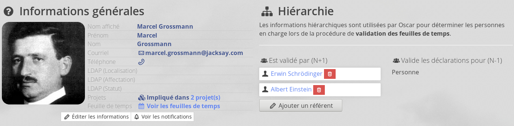

# Feuille de temps

## Déclarant

### Accès à l'interface de déclaration

L'accès à l'écran de déclaration est disponible directement depuis la page d'accueil aux personnes identifiées comme "déclarant" sur un ou plusieurs lots dans une activité.


### Identifier un déclarant

Pour identifier une personne comme "déclarant", il faut, dans *l'activité*, créer des lots de travail, puis identifier comme "déclarant" des membres de cette activité.


Note : Cet écran permet de voir les heures en cours de saisie, les heures validées et les heures en conflit. Le total prévu est pour l'instant purement informatif et n'est pas utilisé dans les contrôles automatiques.

### Interface de déclaration

Elle permet au déclarant d'indiquer le temps passé sur les activités où il est identifié comme déclarant et le temps hors-lot. Lorsqu'un mois est terminé, il peut soumettre sa déclaration.


### Importation des ICAL

Une interface permet de charger les informations depuis un calendrier (ICAL/ICS)


Vous pouvez **désactiver cette option** dans la configuration générale : 

```php
<?php
// config/autoload/local.php
return array(
    // Oscar
    'oscar' => [
        // ...
        // Désactiver (false) ou Activer (true) l'importation des ICAL
        'importEnable' => false,
        
        // ...
    ]
);
```


### Suivi des déclarations

Accessible au déclarant et depuis la fiche activité par les personnes autorisées. Elle permet de **visualiser les feuille de temps** validées ainsi de de les prévisualiser (avant validation).

On peut également voir les validateurs impliqués selon l'étape de validation, et les potentiels dépassements de temps via un indicateur visuel.


### Export des feuilles de temps

Les données saisies permettent de produire un document au format Excel qui synthétise les informations de la déclaration. Pour le moment, l'affichage des informations ne propose que le format heure.


#### Saisie en Heures/pourcentages

L'option `(boolean)declarationsHours` permet de configurer la mode de déclaration. Sur `true`, la déclaration affichera des heures, sinon la déclaration sera en pourcentage.

```php
<?php
return array(
    'oscar' => [
        // ...
        
        // Mode de déclaration (pourcentage/heure)
        'declarationsHours' => false,
    ]
);
```

L'option `(boolean)declarationsHoursOverwriteByAuth` permet d'autoriser les utilisateurs à choisir dans le menu préférences le mode d'affichage.

```php
<?php
return array(
    'oscar' => [
        // ...
        
        // Mode de déclaration (pourcentage/heure)
        'declarationsHoursOverwriteByAuth' => true,
    ]
);
```

Le déclarant pourra choisir son mode de saisie depuis ces paramètres personnels : 


#### Répartition horaire

La répartition permet de savoir comment sont distribuées les heures attendues d'une personne dans la semaine. Cela permet également de résoudre les cas particuliers (amménagement de temps de travail, temps partiel, mi-temps, etc...).

Par défaut, la répartition est telle que définie dans la configuration Oscar. La clef `declarationsDurations` permet de configurer la répartition horaire, ces valeurs seront utilisées pour l'affichage en pourcentage, et seront utilisées pour le remplissage des journées avec le choix **remplir**.

```php
<?php
// config/autoload/local.php
return array(
    'oscar' => [   
        // ...
        
        // Durées utilisées pour les contrôles
        'declarationsDurations' => [
            
            // Durée des journées
            'dayLength'     => [
                
                // Durée d'une journée par défaut
                'value' => 7.5,
                
                // Durée maximum
                // Note : Oscar applique un contrôle à partir de
                // cette valeur, si elle est dépassée, la feuille
                // de temps ne pourra pas être envoyée.
                'max' => 10.0,
                
                // Durée spécifique à la journée
                'days' => [
                    '1' => 7.5, // Lundi
                    '2' => 7.5, // Mardi
                    '3' => 7.5, // Mercredi
                    '4' => 7.5, // Jeudi
                    '5' => 7.5, // Vendredi
                    '6' => 0.0, // Samedi
                    '7' => 0.0, // Dimanche
                ]
            ],
        ],
    ]
);
```

Les personnes ayant le privilège **Personne > peut modifier la répartition horaire** pourra, depuis la fiche personne, modifier les horaires de la personne.


Cette configuration est établie pour les prochaines déclarations envoyées.

En modifiant la répartition horaire depuis la fiche personne, vous pouvez configurer Oscar pour proposer des modèle prédéfinit de répartition : 

```php
return array(
    // ...

    // Oscar
    'oscar' => [
        // ...

        // Exemples de modèle horaire
        'scheduleModeles' => [
            'full35' => [
                'label' => 'Plein temps (35 heures)',
                'week' => 35.0,
                'days' => [
                    1 => 7.0,
                    2 => 7.0,
                    3 => 7.0,
                    4 => 7.0,
                    5 => 7.0
                ]
            ],
            'full37' => [
                'label' => 'Plein temps (37 heures)',
                'week' => 37.0,
                'days' => [
                    1 => 7.5,
                    2 => 7.5,
                    3 => 7.5,
                    4 => 7.5,
                    5 => 7.0
                ]
            ],

            'half35' => [
                'label' => 'Mi-temps',
                'week' => 17.5,
                'days' => [
                    1 => 3.5,
                    2 => 3.5,
                    3 => 3.5,
                    4 => 3.5,
                    5 => 3.5
                ]
            ],

            'parttime' => [
                'label' => 'Temps patiel',
                'week' => 30.0,
                'days' => [
                    1 => 6.0,
                    2 => 6.0,
                    3 => 6.0,
                    4 => 6.0,
                    5 => 6.0
                ]
            ],
        ],
    ]
)
```

Ces modèles seront disponibles pour remplir automatiquement la répartition de la personne et également proposée pour une synchronisation via les connector (A venir).

**Evolution prévue 1** : Une option permettra d'autoriser le déclarant à soumettre sa répartition horaire. La personne en charge de modifier la répartition horaire pourra valider la modification demandée.

**Evolution prévue 2** : Une option permettra d'autoriser le N+1 du déclarant à valider/modifier sa répartition horaire.


#### Choix "Hors-Lot" disponibles

Pour configurer les créneaux disponibles hors activité. La clef `horslots` **doit être défini** dans le fichier `config/autoload/local.php`.

**Ajout version 2.10 "Creed"** : Afin de gérer les sous-totaux dans le rendu des feuilles de temps, une clef `group` a été ajoutée et necessite une des valeurs ci-dessous :
                                 
- `research` : Comptabilisé comme recherche (produire un sous-total avec les heures des Projets)
- `abs` : Créneaux non-travaillé (Congès, Arret maladie)
- `education` : Créneaux comptabilisés comme enseignement
- `other` : Autre

```php
<?php
// config/autoload/local.php
return array(
    'oscar' => [
        // EXEMPLE
        'horslots' => [
            'conges' => [
                'code' => 'conges',
                'group' => 'abs',
                'label' => 'Congés',
                'description' => '',
                'icon' => true ],
            'training' => [
                'code' => 'training',
                'group' => 'other',
                'label' => 'Formation',
                'description' => '',
                'icon' => true ],
            'teaching' => [
                'group' => 'education',
                'code' => 'teaching',
                'label' => 'Enseignement',
                'description' => '',
                'icon' => true ],
            'sickleave' => [
                'group' => 'abs',
                'code' => 'sickleave',
                'label' => 'Arrêt maladie',
                'description' => '',
                'icon' => true ],
            'research' => [
                'group' => 'research',
                'code' => 'research',
                'label' => 'Autre recherche',
                'description' => '',
                'icon' => true ],
            'other' => [
                'group' => 'other',
                'code' => 'other',
                'label' => 'Divers',
                'description' => 'Autre activité',
                'icon' => true ],
        ],
    ]
);
``` 

**IMPORTANT** : Une fois les catégories Hors-Lots disponibles configurées, il ne faut pas les modifier, en effet, des créneaux pourraient avoir été utilisés avec cette qualification et necessiter de la maintenance sur la base de données pour réaffecter ces créneaux dans une autre catégorie.

#### Mécanisme général

Lorsqu'un déclarant soumet ses heures, Oscar va **COPIER** les données pour la validation au jour de l'envoi : 

 - Les validateurs
 - La configuration horaire
 
Cela permet de s'adapter à des changements de validateur / horaires à posteriori


#### Administrer les déclarations

Une fois la déclaration soumise, il est possible que des problèmes surviennent. L'administrateur dispose d'un écran de contrôle avec toutes les déclarations et leur état.


Cet écran permet : 

 - Contrôler l'état de validation des différentes lignes
 - D'annuler une déclaration
 - Modifier les horaires de la personne sur la période
 - Ajouter / supprimer des validateurs


### N+1 

La validation des créneaux *Hors-Lots* est assurée par les N+1. Ces derniers peuvent être administrés depuis la fiche personne par l'administrateur. (Connecteur à venir)



**Évolution prévue** : 
 - Un connecteur pour mettre à jour les N+1 depuis le SI
 - Une option pour attribuer par défaut la personne ayant un rôle précis dans la même organisation que le déclarant.
 - Une interface permettant de remplacer un N+1 par un autre
 
 
## Validation
   
Une déclaration envoyée est composée de plusieurs "ligne" :

- Une ligne par activité, ligne dite "activité"
- Une ligne dite "Hors-Lot" qui regroupe les déclarations hots activité


### Validation des lignes activités

Les lignes activité ont 3 étapes de validation :

- Étape 1 : validation **projet**
- Étape 2 : validation **scientifique**
- Étape 3 : validation **administrative** 

Chacune de ces étapes est associée à un privilège qui peut être accordé dans la gestion des privilèges.

Avec le privilège "Voir les feuilles de temps sur une activité", on peut également voir les validateurs des différentes étapes : 


### Accès validateur

Les validateurs disposeront automatiquement d'une interface de validation depuis la page d'accueil : 


L'écran de validation propose le détail des déclarations à valider, son état de validation et les validateurs impliqués : 


A noter que le validateur dispose d'indicateurs visuels dans la ligne TOTAL pour détecter d'éventuels dépassements "incohérent". La réactivité de ces indicateurs peut être configuré dans Oscar : 

```php
<?php
// config/autoload/local.php
return array(
   
    'oscar' => [
        // Indication visuelle de dépassement problématique
        // Journée de 8.0 heures => déclaré 8.0*.5 = 4.0
        'declarationAmplitudeMin' => .75,

        // Journée de 8.0 heures => 8.0*1.125 = 9.0
        'declarationAmplitudeMax' => 1.25,
    ]
);
```

L'alerte prend en compte la durée prévue de la journée, par exemple si la "réaction" minimum est réglée sur 0.5, que le déclarant doit déclarer 4 heures, l'indicateur passera au rouge en dessous de 4*.5 (soit 2 heures), et sera en rouge "léger" entre 2 et 4 heure. Les mêmes indicateurs s'appliquent avec l'amplitude maximum.


## Synthèse et feuille de temps

Le privilège "Voir les feuilles de temps" permet, depuis la fiche activité de voir le récapitulatif des déclarations pour l'activité pour chaque déclarant : 


Cet écran propose un récapitulatif par mois des déclarations


Et le détails de chaque déclaration


## Documents générés

Les documents générés disposent de plusieurs options disponibles dans l'interface de configuration Oscar


### Personnalisation des rendus

Vous pouvez modifier le rendu des documents en dupliquant les gabarits fournit par défaut : 

 - Rendu des feuilles de temps individuelle mensuelle (`data/templates/timesheet_person_month.default.html.php`)
 - Rendu des feuilles de temps de synthèse mensuelle des activités (`data/templates/timesheet_activity_synthesis.default.html.php`)
 
Vous pouvez dupliquer les templates : 

```bash
cp data/templates/timesheet_person_month.default.html.php data/templates/timesheet_person_month.html.php
cp data/templates/timesheet_activity_synthesis.default.html.php data/templates/timesheet_activity_synthesis.html.php
``` 

Puis surchargez la configuration dans le fichier `config/autoload/local.php` :

```php
<?php
// config/autoload/local/php
return array(
    // ..
    'oscar' => [
        // ...
        // Emplacement du template pour les feuilles de temps individuelles mensuelles
        'timesheet_person_month_template' => realpath(__DIR__.'/../../data/templates/timesheet_person_month.html.php'),

        // Emplacement du template pour les feuilles de temps des synthèse des activités
        'timesheet_activity_synthesis_template' => realpath(__DIR__.'/../../data/templates/timesheet_activity_synthesis.html.php'),
        
        //...
    ]
);
```

> Les fichiers `data/templates/timesheet_person_month.html.php` et `data/templates/timesheet_activity_synthesis.html.php` seront ignorés par GIT.


## Usurpation

Oscar intègre un mécanisme d'*usurpation* pour autoriser un tiers de compléter la feuille de temps d'une autre personne.

L'interface de saisie est accessible depuis la fiche de la personne.


### Globale

Cette fonctionnalité peut être accordée de façon générale via les privilèges, ou individuellement à partir de la fiche personne : 


