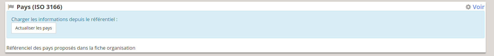

# Spartan Release

## Passage à Debian 11 "Bullseye"

>La procédure de mise à jour proposée ici a été appliquée sur les instances Unicaen avec succès. Elle peut ne pas correspondre exactement à votre système.

### MISE à JOUR DEBIAN 10 > 11

Commencez par mettre à jour le système (Passage à la version **DEBIAN 11 "Bullsyes"**). 

```bash
# Sources en Bullseye
for file in \
  $(ls /etc/apt/sources.list.d/*buster*)
  do new=$(echo $file | sed s/buster/bullseye/)
  cp $file $new; sed -i s/buster/bullseye/ $new
done

# Cas particulier pour security
sed -i 's/bullseye\/updates/bullseye-security/' /etc/apt/sources.list.d/debian.unicaen.fr-bullseye-security.list

# update des sources
apt -qq update

# Mise à jour du serveur SSH d'abord
# Cf https://www.debian.org/releases/bullseye/amd64/release-notes/ch-information#ssh-not-available
apt -y -o Dpkg::Options::="--force-confold" install openssh-server
apt -y full-upgrade -o Dpkg::Options::="--force-confold" --allow-downgrades
apt -y autoremove
```

### Installation de PHP7.4

> Pour éviter les problèmes de compatibilité, il est fortement recommandé de supprimer les anciennes version de php avec `apt remove`

Installation des paquets PHP

```bash
apt install php7.4 \
 php7.4-bcmath  \
 php-bz2 \
 php7.4-cli \
 php7.4-curl \
 php7.4-dom \
 php7.4-gd \
 gearman-php \
 php7.4-intl \
 php7.4-ldap \
 php7.4-mbstring \
 php7.4-pdo-pgsql \
 php7.4-xml  \
 php7.4-zip
```


### Passage PHP7.3 > PHP7.3

> Si vous conservez d'ancienne versions de PHP, Il faut configurer l'utilisation de PHP pour l'utilisation en ligne de commande (**cli**) et *Apache* :

#### Pour PHP-CLI

```bash
update-alternatives --config php
```

Choisir PHP 7.4 :

```
Il existe 2 choix pour l'alternative php (qui fournit /usr/bin/php).

  Sélection   Chemin           Priorité  État
------------------------------------------------------------
  0            /usr/bin/php7.4   74        mode automatique
* 1            /usr/bin/php7.3   73        mode manuel
  2            /usr/bin/php7.4   74        mode manuel

Appuyez sur <Entrée> pour conserver la valeur par défaut[*] ou choisissez le numéro sélectionné :0
update-alternatives: utilisation de « /usr/bin/php7.4 » pour fournir « /usr/bin/php » (php) en mode automatique
```

#### Pour le module PHP Apache

Mettre à jour le module PHP de Apache :

```
a2dismod php7.3
systemctl restart apache2
a2enmod php7.4
systemctl restart apache2
```

#### OCI

Le module PHP *OCI8* assure la connexion entre Oscar et SIFAC, pour l'installer, suivez la procédure suivante : [Installation OCI8 pour PHP7.4](./install-oracle-pp.md)

#### Vérifier

Vérifier que tout les modules PHP sont bien chargés en 7.4 :

```bash
php bin/oscar.php check:config
```

```
------------- --------- -----------
 Modules PHP   Version   Statut
------------- --------- -----------
 bz2           7.4.21    Installed
 curl          7.4.21    Installed
 fileinfo      7.4.21    Installed
 gd            7.4.21    Installed
 gearman       2.1.0     Installed
 iconv         7.4.21    Installed
 json          7.4.21    Installed
 ldap          7.4.21    Installed
 mbstring      7.4.21    Installed
 openssl       7.4.21    Installed
 pdo_pgsql     7.4.21    Installed
 posix         7.4.21    Installed
 Reflection    7.4.21    Installed
 session       7.4.21    Installed
 xml           7.4.21    Installed
 zip           1.15.6    Installed
------------- --------- -----------
```

## Passage à composer 2.x

Oscar supporte maintenant *Composer 2.x*

```
wget https://getcomposer.org/download/latest-stable/composer.phar
```

## Passage sur la branche "Spartan"

```bash
git fetch
git checkout spartan

# Installation des dépendances
php composer.phar install

# Mise à jour du modèle
php vendor/bin/doctrine-module orm:schema-tool:update --force

# Mise à jour des privilèges
php bin/oscar.php check:privileges
```

> Il est possible de Github vous demande de générer un *token* d'accès (à créer depuis github.com)

### Mise à jour de la configuration LDAP

Configuration de l'authentification

```php
<?php
// config/autoload/unicaen-auth.local.php
$settings = array(
    // Authentification via LDAP/BDD
    'local' => [
        'order' => 2,
        'enabled' => true,
        'db' => [
            'enabled' => true,
        ],
        'ldap' => [
            'enabled' => false,
        ],
    ],
    
    // CAS
    'cas' => [
        'order' => 1,
        'enabled' => false,
        'connection' => [
            'default' => [
                'params' => [
                    'hostname' => 'host.domain.fr',
                    'port'     => 443,
                    'version'  => "2.0",
                    'uri'      => "",
                    'debug'    => false,
                ],
            ],
        ]
    ]
);

/**
 * You do not need to edit below this line
 */
return array(
    'unicaen-auth' => $settings,
);
```

### Relancer le OscarWorker

Oscar *"Spartan"* propose un refonte du système de recalcule des Notifications et de la réindexation. A ce titre, le Worker a été modifié, il faudra donc le relancer : 

```bash
service oscarworker stop
service oscarworker start
```

Vérifier son fonctionnement

```bash
# On affiche les logs du Worker
journalctl -u oscarworker -f
```

Dans une autre fenêtre, vous pouvez déclencher un *check:config* et surveiller l'activité dans les logs du worker

```
php bin/oscar.php check:config
```

Vous devriez voir dans les logs du Worker ce type de sortie : 

```
oct. 11 10:41:10 woscar-pp systemd[1]: Stopped OSCAR Worker.
oct. 11 10:41:14 woscar-pp systemd[1]: Started OSCAR Worker.
oct. 11 10:41:14 woscar-pp php[378252]: ###################################################################
oct. 11 10:41:14 woscar-pp php[378252]: # OSCAR WORKER STARTED v2.12.0-spartan#0fd55cfe "Spartan" (2021-10-06 14:10:01) SPARTAN
oct. 11 10:41:14 woscar-pp php[378252]: # working directory : '/var/OscarApp/oscar/bin'
oct. 11 10:41:14 woscar-pp php[378252]: ###################################################################
oct. 11 10:43:46 woscar-pp php[378252]: stdClass Object
oct. 11 10:43:46 woscar-pp php[378252]: (
oct. 11 10:43:46 woscar-pp php[378252]:     [message] => Check Config Oscar
oct. 11 10:43:46 woscar-pp php[378252]: )
oct. 11 10:43:46 woscar-pp php[378252]: [worker] Hello with 1
```

Les logs Oscar ont également été enrichies, les interactions entre Oscar et Gearman y sont visibles : 

```bash
tail -f logs/oscar.log
```

Vous devrier pouvoir y observer l'échange entre Oscar > Gearman > Command oscar

```
[2021-10-11T10:43:46.641506+02:00] oscar.INFO: [COMMAND] check:config [] []
[2021-10-11T10:43:46.765458+02:00] oscar.INFO:  > [gearman:call] TEST OK] [] []
```

Vous pouvez vérifier le processus d'actualisation de l'index en allant dans une activité de recherche et y ajouter un responsable scientifique, les logs Oscar détailleront les opérations effectuées : 

```
[2021-10-11T11:41:24.014487+02:00] oscar.INFO: a supprimé [Person:5063:Stephane Bouvry](Responsable scientifique) dans l'activité [Activity:11842:Présentation OSCAR Nanterre - subvention - comete]  [] []
[2021-10-11T11:41:24.292731+02:00] oscar.NOTICE: CMD success : Notifications mises à jour '[2021DRI00012] Présentation OSCAR Nanterre - subvention - comete' [] []
[2021-10-11T11:41:24.514452+02:00] oscar.NOTICE: CMD success : Index de recherche mis à jour pour '[2021DRI00012] Présentation OSCAR Nanterre - subvention - comete' mis à jour [] []
[2021-10-11T11:41:24.735195+02:00] oscar.NOTICE: CMD success : Index de recherche mis à jour pour 'Stephane Bouvry' mis à jour [] []
```

Et dans les logs du *worker* : 

```
oct. 11 11:41:24 woscar-pp php[378252]: [worker] exec /usr/bin/php bin/oscar.php console  notificationsactivity '{"activityid":11842}'
oct. 11 11:41:24 woscar-pp php[378252]: [worker] exec /usr/bin/php bin/oscar.php console  indexactivity '{"activityid":11842}'
oct. 11 11:41:24 woscar-pp php[378252]: [worker] exec /usr/bin/php bin/oscar.php console  indexperson '{"personid":5063}'
```

> Le worker déclenche maintenant des commandes "natives" Oscar. En cas de problème, vous pouvez copier/coller les commandes depuis les logs du *worker* pour tester le résultat.

### Réindexation de la recherche

Il est chaudement recommandé de recalculer les index de recherche : 

```
# Index des activités
php bin/oscar.php activity:search-rebuild -f

# Index des Organisations
php bin/oscar.php organization:search-rebuild

# Index des personnes
php bin/oscar.php person:search-rebuild
```


## Problèmes connus

### Elastic : cluster_block_exception

Lors des actions impliquant l'index de recherche (Elastic Searchà, vous pouvez voir passer l'erreur **cluster_block_exception** (elle est visible dans log/oscar.log) : 

```
[2021-10-11T10:51:43.473403+02:00] oscar.ERROR: CMD error : {"error":{"root_cause":[{"type":"cluster_block_exception","reason":"blocked by: [FORBIDDEN/12/index read-only / allow delete (api)];"}],"type":"cluster_block_exception","reason":"blocked by: [FORBIDDEN/12/index read-only / allow delete (api)];"},"status":403} [] []
```

C'est que **Elastic Search** est passé en mode *readonly*. Ce problème est généralement consécutif à une saturation de l'espace disque.

Pour régler le problème, faites un peu de place sur la machine, puis faites sauter le verrou placé par Elastic via la commande CURL : 

```
curl -XPUT -H "Content-Type: application/json" http://localhost:9200/_all/_settings -d '{"index.blocks.read_only_allow_delete": null}'
```

### Installation des référentiels

Depuis l'interface d'administration : `Administration > Configuration et maintenance` :

 - Dans la section **Nomenclatures > Pays (ISO 3166)**, cliquez sur le bouton **Actualiser les pays**



 - Dans la section **Modules > PCRU**, cliquez sur le bouton **Mettre à jour les référentiels**.


### Activer PCRU

Depuis l'interface d'administration : `Administration > Configuration et maintenance`, Allez dans la section **Module > PCRU** puis cliquez sur **"configurer"**


Activez PCRU.

> L'accès FTP est fonctionnel, mais cette fonctionnalité est encore expérimentale

### Privilèges PCRU

Enfin, il faut accorder des privilèges à des utilisateurs pour géré la partie PCRU d'une activité de recherche.

Rendez-vous dans **Administration > Configuration et maintenance > Privilèges et droits d'accès > Privilèges et rôles**

Plusieurs privilèges sont disponibles.

#### Au niveau de l'activité


 - **Afficher les informations PCRU** : Permet de voir les données PCRU pour l'activité et de télécharger les données PCRU d'une activité.
   
 - **Activer les données PCRU** : Permet de modifier/valider les informations PCRU d'une activité

 