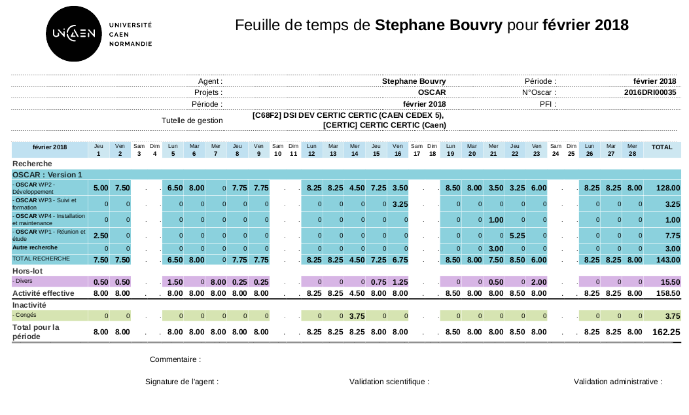
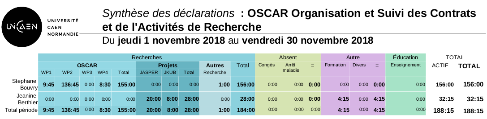

# version 2.10 "Creed"

## ATTENTION : PHP 7.3

La version *Creed* necessite une mise à jour des librairies PHP via **composer**, vous devrez préalablement faire une mise à jour de la version de PHP en passant à la version **PHP 7.3**. Attention, Postgresql doit rester en version 9.x. 

### Mise à jour de PHP sur Debian

```bash
# Ajouter les dépôts PHP  (Merci Damien)

# Installation des utilitaires pour gérer les certificats
apt -y install lsb-release apt-transport-https ca-certificates
 
# Récupération et mise à jour du source.list 
wget -O /etc/apt/trusted.gpg.d/php.gpg https://packages.sury.org/php/apt.gpg
echo "deb https://packages.sury.org/php/ $(lsb_release -sc) main" | tee /etc/apt/sources.list.d/php7.3.list

# Mise à jour des sources
apt update
apt upgrade

# Installation de PHP 7.3
apt install php7.3 php7.3-bz2 php7.3-cli php7.3-curl php7.3-dom php7.3-gd php7.3-intl php7.3-ldap php7.3-mbstring php7.3-pgsql php7.3-xml php7.3-zip

# Configuration de PHP 7.3 comme version de PHP par défaut
update-alternatives --set php /usr/bin/php7.3
update-alternatives --set phar /usr/bin/phar7.3
update-alternatives --set phar.phar /usr/bin/phar.phar7.3

# MAJ du module PHP de Apache
a2dismod php7.0
a2enmod php7.3
systemctl restart apache2
```

Puis mettre à jour Oscar : 

```bash
# MAJ Oscar
git checkout creed
git pull

# MAJ des librairies PHP
composer install

# MAJ de la BDD
php vendor/bin/doctrine-module orm:schema-tool:update --dump-sql
php vendor/bin/doctrine-module orm:schema-tool:update --force
```

> Lors de la mise à jour des librairies PHP, si vous avec les composants PHP manquants, insallez les via `apt` (merci des les signaler pour les ajouter à la liste des prérequis PHP de la documentation)


## Nouveautés

### Documents des feuilles de temps (2019/09)

Cette version inclue des outils pour générer des feuilles de temps au format PDF à partir des saisies utilisateur. 

Feuille de temps personnel (par personne / par mois)



Document de synthèse mensuelle pour une activité


Une ligne de sous-total **Activité effective** qui exclue les créneaux Hors-Lot du groupe **abs** a été ajoutée

La modification des gabarits de mise en page a été simplifiée.

Plus d'information [Feuilles de temps dans Oscar](../timesheet.md)


### Gestion des N+1 (2019/09)

Cette version a ajouté une fonctionnalité pour **ajouter des N+1** (Personnes en charge de valider les déclaration Hors-Lot des déclarants) à partir de la fiche d'un N+1. La fonctionnalité permet soit de **ajouter un valideur** (affecter à une autre personne les même subordonnés) ou de **remplacer** le N+1.

La liste des personnes dispose maintenant d'un filtre **N+1**


### Nouveau 25 Juin : Importation ICAL en option

Une option `importEnable` a été ajoutée pour rendre optionnelle la fonctionnalité pour importer les ICAL dans les feuilles de temps. Pour retirer cette fonctionnalité, éditer le fichier de configuration `config/autoload/local.php` : 

```php
<?php
// config/autoload/local.php
return array(
    // Oscar
    'oscar' => [
        // ...
        'importEnable' => false,
        
        // ...
    ]
);
```

### Groupe hors-lots

Afin de gérer les sous-totaux dans le rendu des feuilles de temps, vous devez spécifier une clef `group` pour chaques choix "Hors-lot" avec une des valeurs suivantes :

 - `research` : Comptabilisé comme recherche (produire un sous-total avec les heures des Projets)
 - `abs` : Créneaux non-travaillés (Congès, Arret maladie)
 - `education` : Créneaux comptabilisés comme enseignement
 - `other` : Autre

```php
<?php
// config/autoload/local.php
return array(
    // Oscar
    'oscar' => [
        // ...
        'horslots' => [
            'conges' => [
                'group' => 'abs',
                'code' => 'conges',
                'label' => 'Congés',
                'description' => 'Congès, RTT, récupération', 'icon' => true ],
            'training' => [
                'group' => 'other',
                'code' => 'training',
                'label' => 'Formation',
                'description' => 'Vous avez suivi un formation, DIFF, etc...', 'icon' => true ],
            'teaching' => [
                'group' => 'education',
                'code' => 'teaching',
                'label' => 'Enseignement',
                'description' => 'Cours, TD, fonction pédagogique', 'icon' => true ],
            'sickleave' => [
                'group' => 'abs',
                'code' => 'sickleave',
                'label' => 'Arrêt maladie',
                'description' => '', 'icon' => true ],
            'research' => [
                'group' => 'research',
                'code' => 'research',
                'label' => 'Autre recherche',
                'description' => 'Autre projet de recherche (sans feuille de temps)', 'icon' => true ],
            'other' => [
                'group' => 'other',
                'code' => 'other',
                'label' => 'Divers',
                'description' => 'Autre activité', 'icon' => true ],
        ],
    ]
);
```

La documentation des feuilles de temps est à jour [Configuration des feuilles de temps](../timesheet.md)

### Système de recherche des Personnes (2019/05)

Cette option **implique des changements dans la configuration !**

Le système de recherche des personnes a été améliorée et permet maintenant de configurer **ElasticSearch** pour les recherches. [Configuration de la recherche des personnes](../configuration.md#recherche-des-personnes)

Pensez à utiliser l'utilitaire en ligne de commande pour reconstruire l'index de recherche.

```bash
php public/index.php oscar persons:search:build
```

### Système de recherche des Organisations (2019/06)

Cette option **implique des changements dans la configuration !**

Le système de recherche des organisations a été amélioré et permet maintenant de configurer ElasticSearch pour les recherches. [Configuration de la recherche des organisations](../configuration.md#recherche-des-organisations)

Pensez à utiliser l'utilitaire en ligne de commande pour reconstruire l'index de recherche.

```bash
php public/index.php oscar organizations:search:build
```

### Synthèse (2019/05)

Une option de **synthèse générale (v2)** est accessible depuis la fiche d'une activité. Elle offre une vision globale aux chargés de valorisation sur l'état des heures déclarées pour un projet, par période et par personne, elle permet de contrôler rapidement le cumul des heures :


En cliquant sur **Détails**, une vue plus précise permet de voir la répartition déclarée par la personne pour la période choisie :


Une version excel de la synthèse est disponible.


### Section des documents publics

Les documents publics peuvent maintenant être organisés en section. Les sections doivent être configurées dans la partie configuration par l'administrateur.


## FIX/ISSUES

 - Optimisation des resultats de recherche et option de recherche "proche" activée
 - Lenteur dans l'autocompeteur des personnes (requête modifiée)
 - Refonte de la gestion des partenaires/membres dans le fiche activité
 - Dans la fiche organisation (nouvelle organisation), le contrôle de l'existant utilise maintenant le nom complet et l'acronyme, le champ "Nom complet" a été placé en tête.
 - La vue versement utilise maintenant l'espace comme séparateur des milliers pour les montants.
 - L'affichage du temps écoulé des documents se base maintenant sur les minutes pour éviter l'affichage "Il y a 11 heures sur un fichier déposé à n'importe quel moment de la journée"
 - La personne "uploadant" est correctement stoquée
