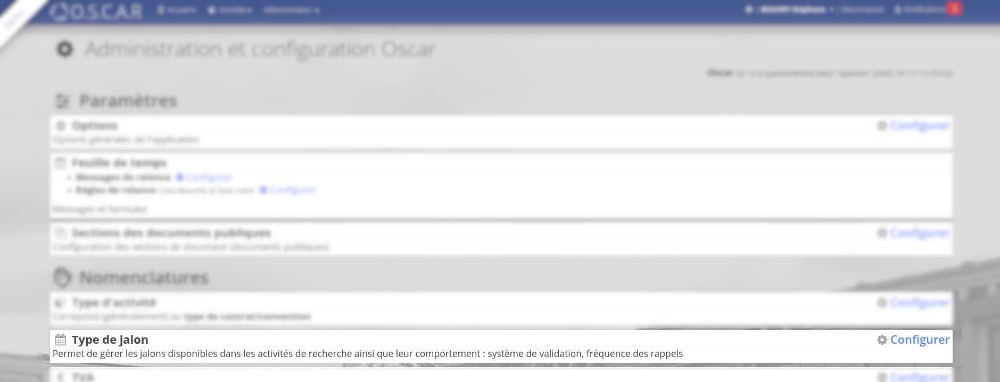
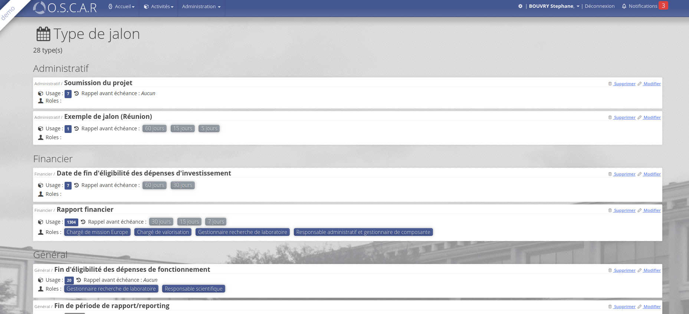
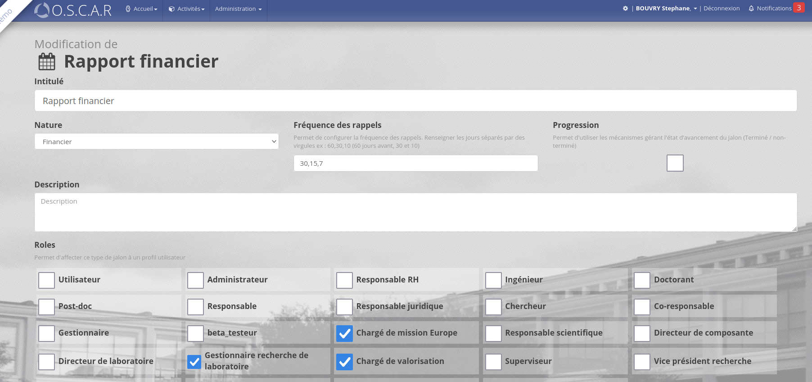
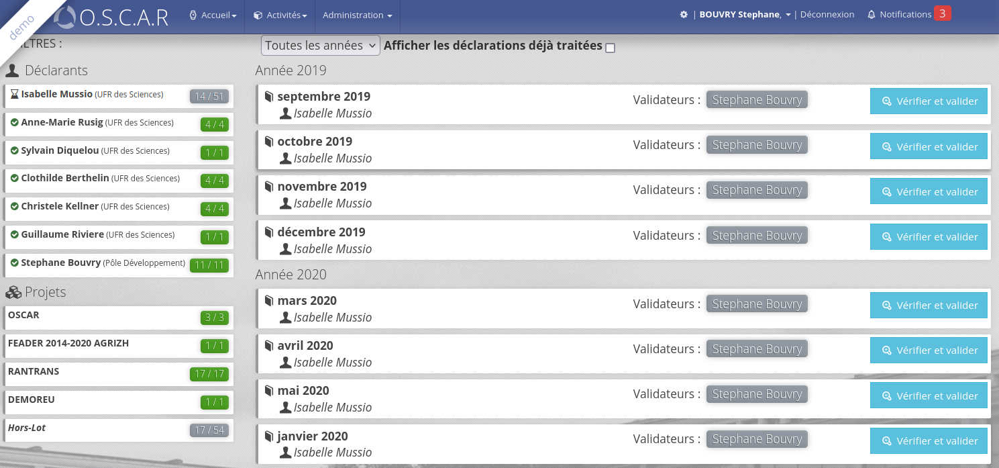
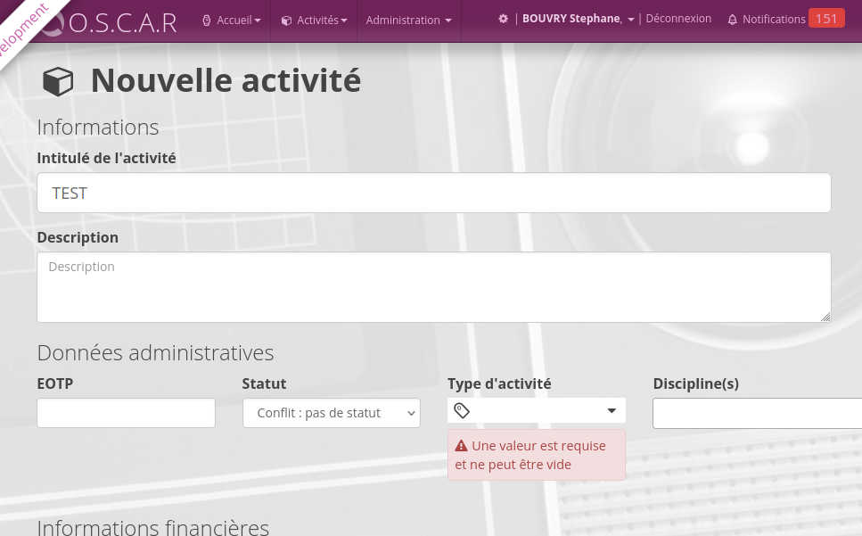

# version 2.12.1 "Spartan"

## Nouveautés

### Rôle à notifier sur les types de jalon

La configuration des types de jalons implique de sélectionner les rôles qui seront notifiés pour ce type de jalon. (Les jalons restent visibles normalement).

Depuis le menu d'**administrantion > type de jalon** : 



Les rôles impliqués sont visibles dans la liste



On peut les modifier en cliquant sur modifier, puis cocher les rôles à notifier : 




### UI de validation V2

Depuis l'accueil d'oscar, les validateurs auront accès par défaut à l'**interface de validation v2** en cliquant sur validation des feuilles de temps

> L'ancienne interface reste accessible en cliquant sur la petite flèche à droite du bouton



Ce nouvelle écran permet de : 

 - Filtrer par personne/projet/année
 - La validation en un clique*

>* **validation en un clique** AVANT, si un validateur avait plusieurs "ligne" à valider, par exemple la validation pour un projet ET pour les créneaux Hors-lots, il devait valider pour chaque "ligne" une par une. Maintenant, tous est validé en même temps. 

### Type d'activité requis



### Mise à jour technique

Procédure habituelle, mise à jour des sources : 

```bash
git fetch
git pull
```

Mise à jour du schéma (relation entre les rôles et les types de jalon)

```bash
# Pour prévisualiser
php vendor/bin/doctrine-module orm:schema-tool:update --dump-sql

# Pour appliquer
php vendor/bin/doctrine-module orm:schema-tool:update --force
```

Mise à jour des privilèges : 

```bash
# Mise à jour des privileges
php bin/oscar.php check:privileges
```

> Pour des raisons techniques, cette commande doit être exécutée plusieurs fois jusqu'à obtenir un message :
>
> **Les privilèges sont à jour**


