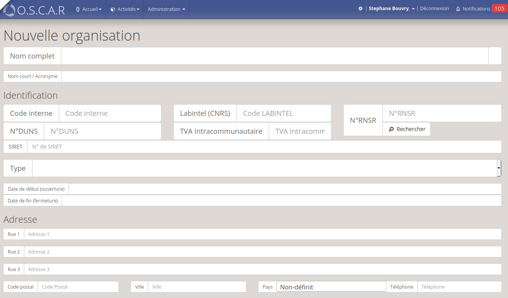
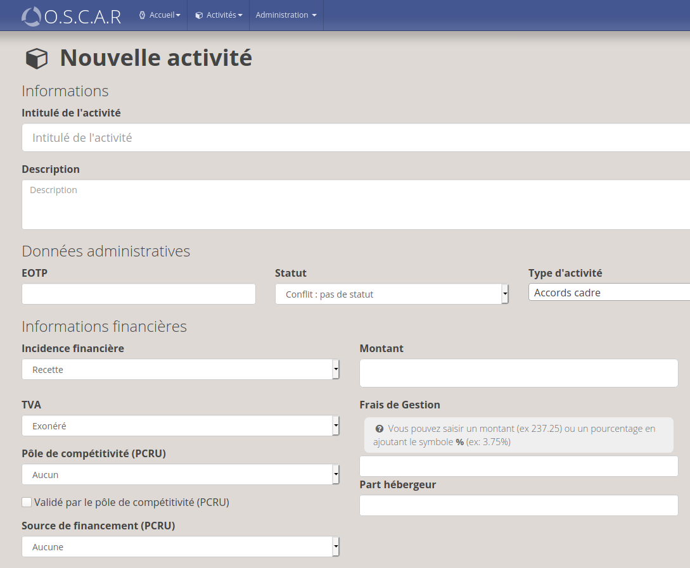
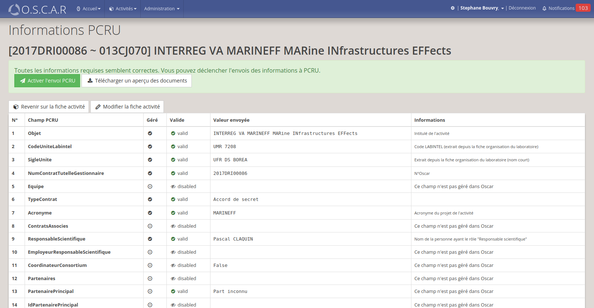
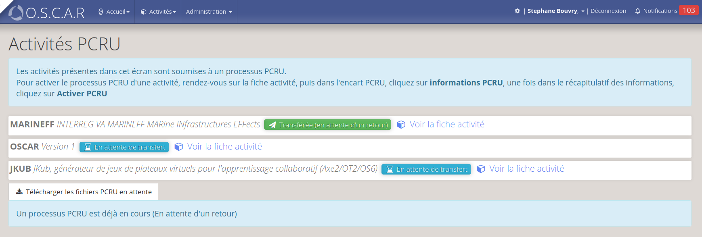
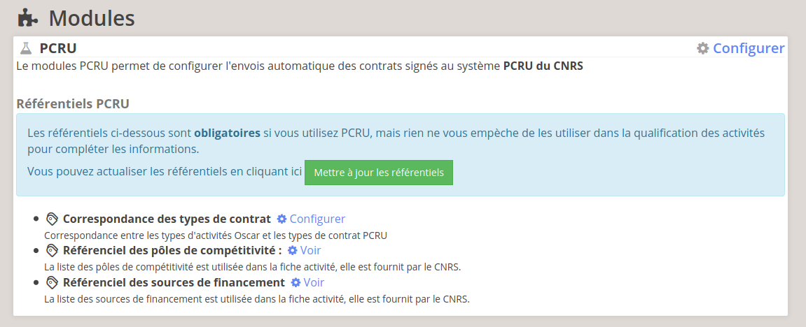
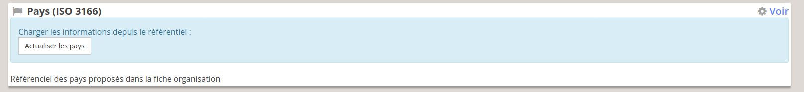
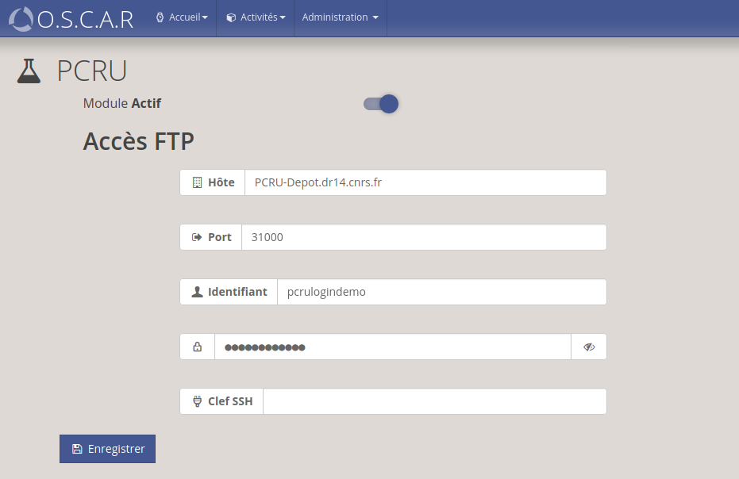

# version 2.12 "Spartan"

## Nouveautés

### MAJ Authentification

L'une des librairies PHP utilisée par Oscar a évoluée et implique des changements mineurs dans la configuration. L'intérêt principal de ce changement est de permettre l'authentification depuis plusieurs systèmes d'authentification (Local/LDAP, CAS, Shibboleth).


### Organisations : Nouveaux champs

Le modèle des organisations a été enrichi, les champs suivants ont été ajoutés dans le modèle des organisations (Connector inclus) : 

 - `duns` : Numéro DUNS, 
 - `tvaintra`  : TVA Intacommunautaire,
 - `labintel` : Numéro Labintel (CNRS)
 - `rnsr` : Numéro RNSR (Répertoire National des Structures de Recherche)



> Ces champs restent facultatifs dans la majorité des cas, mais un de ces champs est attendu par le module PCRU pour authentifier les partenaires


### Activités : Nouveau champs

Les champs : 

 - Source de financement
 - Pôle de compétitivité / Validé par le côle de compétitivité



> Les listes proposent des sources fixes officielles (CNRS)

### Module PCRU

#### Informations PCRU d'une activité

Le module PCRU permet d'automatiser l'extraction des données Oscar vers PCRU. Il propose un nouveau module pour visualiser/gérer les données PCRU d'une activité de recherche depuis la fiche activité :



Si des informations sont manquantes, un message indiquera comment compléter les informations afin de rendre l'activité éligible à PCRU.

Une fois les données valides, vous pourrez rendre les données éligibles pour l'envoi automatique des informations en cliquant sur **Activer l'envoi PCRU**

Vous pouvez également prévisualiser les documents générés en téléchargeant l'aperçu des fichiers générés

> Une évolution future permettra de compléter/préciser certaines informations à cette étape.

### Gestion PCRU

Un écran centralisé permet de visualiser les données PCRU ainsi que leur état.



---

## Mise en place technique

Commencez par appliquer la procédure de mise à jour classique : 
[Procédure de mise à jour Oscar](../update.md)

### Configuration authentification

Vous devez modifier le fichier **config/autoload/local.php**

```php
<?php
// config/autoload/local.php
$settings = array(
    // Authentification via LDAP/BDD
    'local' => [
        'order' => 2,
        'enabled' => true,
        'db' => [
            'enabled' => true,
        ],
        'ldap' => [
            'enabled' => false,
        ],
    ],
    
    // CAS
    'cas' => [
        'order' => 1,
        'enabled' => false,
        'connection' => [
            'default' => [
                'params' => [
                    'hostname' => 'host.domain.fr',
                    'port'     => 443,
                    'version'  => "2.0",
                    'uri'      => "",
                    'debug'    => false,
                ],
            ],
        ]
    ]
);

/**
 * You do not need to edit below this line
 */
return array(
    'unicaen-auth' => $settings,
);
```

### référentiels

- **Pôles de compétitivité** : Le référentiel des pôles de compétitivité peut être actualisé automatiquement depuis l'interface (Configuration et maintenance > Nomenclatures > Référentiel des pôles de compétitivité), le bouton **Actualiser** permet de charger automatiquement le référentiel.

 - **Source de financement** : Le référentiel des sources de financement peut être actualisé automatiquement depuis l'interface (Configuration et maintenance > Nomenclatures > Référentiel des sources de financement), le bouton **Actualiser** permet de charger automatiquement le référentiel.



 - **Pays ISO** : Le référentiel des pays peut être actualisé automatiquement depuis l'interface (Configuration et maintenance > Nomenclatures > Pays, le bouton **Actualiser les pays** permet de charger automatiquement le référentiel.




### Activer PCRU

Vous pouvez activer le module PCRU depuis l'interface d'administration (Administration > Module > PCRU > Configurer)



### Détails PCRU

Le module PCRU permet de gérer et d'automatiser les transmissions d'information avec PCRU.

 > [Configuration du module PCRU](../config-pcru.md)

