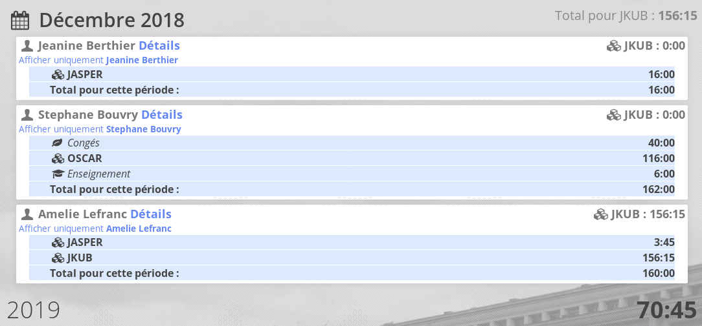
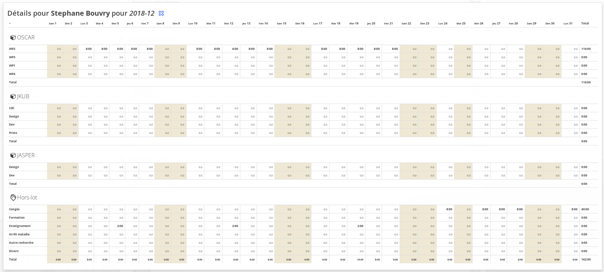

# version 2.10 "Creed"

## Appliquer cette mise à jour depuis Oscar 2.9

Pour appliquer cette mise à jour, suivre la procédure standard détaillée dans le fichier [Procédure de mise à jour Oscar](./doc/update.md)

> Cette mise à jour implique le **Mettre à jour les librairies PHP** avec *composer*. Si des paquets PHP sont manquants, composer vous les indiquera.

En complément, plusieurs options de configuration DOIVENT être complétées :


### Nouveau 25 Juin : Importation ICAL en option

Une option `importEnable` a été ajouté pour rendre optionnel la fonctionnalité pour importer les ICAL dans les feuilles de temps. Pour retirer cette fonctionnalité, éditer le fichier de configuration `config/autoload/local.php` : 

```php
<?php
// config/autoload/local.php
return array(
    // Oscar
    'oscar' => [
        // ...
        'importEnable' => false,
        
        // ...
    ]
);
```

### Groupe hors-lots

Afin de gérer les sous-totaux dans le rendu des feuilles de temps, vous devez spécifier une clef `group` pour chaques choix "Hors-lot" avec une des valeurs suivantes :

 - `research` : Comptabilisé comme recherche (produire un sous-total avec les heures des Projets)
 - `abs` : Créneaux non-travaillé (Congès, Arret maladie)
 - `education` : Créneaux comptabilisés comme enseignement
 - `other` : Autre

```php
<?php
// config/autoload/local.php
return array(
    // Oscar
    'oscar' => [
        // ...
        'horslots' => [
            'conges' => [
                'group' => 'abs',
                'code' => 'conges',
                'label' => 'Congés',
                'description' => 'Congès, RTT, récupération', 'icon' => true ],
            'training' => [
                'group' => 'other',
                'code' => 'training',
                'label' => 'Formation',
                'description' => 'Vous avez suivi un formation, DIFF, etc...', 'icon' => true ],
            'teaching' => [
                'group' => 'education',
                'code' => 'teaching',
                'label' => 'Enseignement',
                'description' => 'Cours, TD, fonction pédagogique', 'icon' => true ],
            'sickleave' => [
                'group' => 'abs',
                'code' => 'sickleave',
                'label' => 'Arrêt maladie',
                'description' => '', 'icon' => true ],
            'research' => [
                'group' => 'research',
                'code' => 'research',
                'label' => 'Autre recherche',
                'description' => 'Autre projet de recherche (sans feuille de temps)', 'icon' => true ],
            'other' => [
                'group' => 'other',
                'code' => 'other',
                'label' => 'Divers',
                'description' => 'Autre activité', 'icon' => true ],
        ],
    ]
);
```

La documentation des feuilles de temps est à jour [Configuration des feuilles de temps](./doc/timesheet.md)

## Système de recherche des Personnes (2019/05)

Cette option **implique des changements dans la configuration !**

Le système de recherche des personnes a été améliorée et permet maintenant de configurer ElasticSearch pour les recherches. [Configuration de la recherche des personnes](./doc/configuration.md#recherche-des-personnes)

Pensez à utiliser l'utilitaire en ligne de commande pour reconstruire l'index de recherche.

## Système de recherche des Organisations (2019/06)

Cette option **implique des changements dans la configuration !**

Le système de recherche des organisations a été améliorée et permet maintenant de configurer ElasticSearch pour les recherches. [Configuration de la recherche des organisations](./doc/configuration.md#recherche-des-organisations)

Pensez à utiliser l'utilitaire en ligne de commande pour reconstruire l'index de recherche.


## Synthèse (2019/05)

Une option de **synthèse générale (v2)** est accessible depuis la fiche d'une activité. Elle offre une vision globale aux chargés de valorisation sur l'état des heures déclarées pour un projet, par période et par personne, elle permet de contrôler rapidement le cumul des heures :



En cliquant sur **Détails**, une vue plus précise permet de voir la répartition déclarée par la personne pour la période choisie :



Une version excel de la synthèse est disponible.


## Section des documents publics

Les documents publics peuvent maintenant être organisés en section. Les sections doivent être configurées dans la partie configuration par l'administrateur.


## FIX/ISSUES

 - Refonte de la gestion des partenaires/membres dans le fiche activité
 - Dans la fiche organisation (nouvelle organisation), le contrôle de l'existant utilise maintenant le nom complet et l'acronyme, le champ "Nom complet" a été placé en tête.
 - Les montants de la vue versement utilise maintenant l'espace comme séparateur des milliers.
 - L'affichage du temps écoulé des documents se base maintenant sur les minutes pour éviter l'affichage "Il y a 11 heures sur un fichier déposé à n'importe quel moment de la journée"
 - La personne "uploadant" est correctement stoquée
