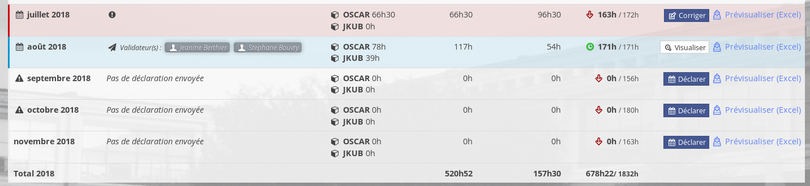
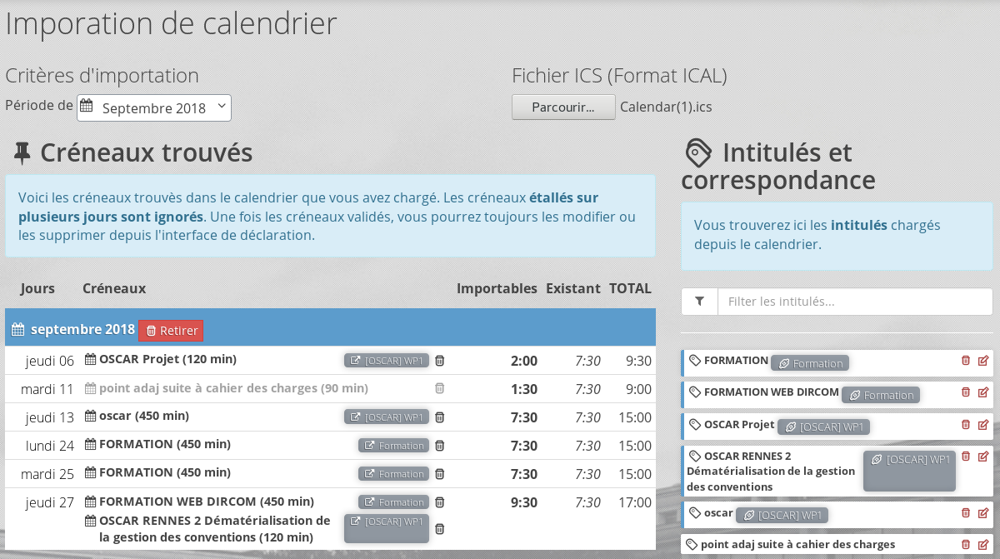
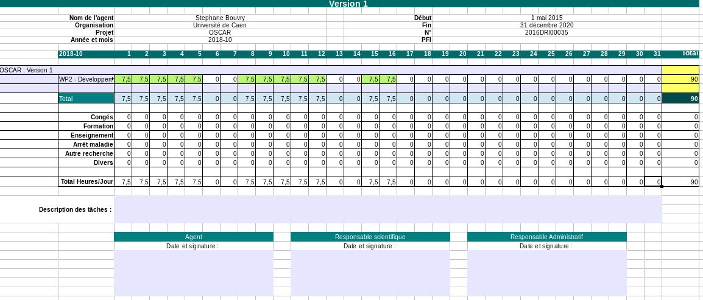

# version 2.8 "Callahan" (Novembre 2018)

Pour appliquer cette mise à jour, suivre la procédure standard détaillée dans le fichier [Procédure de mise à jour Oscar](./doc/update.md)

## Feuille de temps

Refonte compète de l'interface de saisie pour les déclarants.

### Interface de déclaration

L'interface de saisie permet aux déclarants (personnes indentifiées comme déclarant sur un lot de travail dans une activité) de renseigner son activité.

### Interface de validation

### Interface de synthèse Déclarant

Accessible au déclarant et depuis la fiche activité par les personnes autorisées. Elle permet de **visualiser les feuille de temps** validées ainsi de de les prévisualiser (avant validation).

On peut également voir les validateurs impliqués selon l'étape de validation, et les potentiels dépassements de temps via un indicateur visuel.

### Synthèse depuis la fiche activité

Cet écran propose un récapitulatif par mois des déclarations

Et le détails de chaque déclaration

### Importation des ICAL

Un interface permet de charger les informations depuis un calendrier (ICAL/ICS)

### Export des feuilles de temps

Les données saisies permettent de produire un document au format Excel qui syntétise les informations de la déclaration. Pour le moment, l'affichage des informations ne propose que le format heure.

### Gestion des N+1

La validation des créneaux *Hors-Lots* est assurée par les N+1. Ces derniers peuvent être administrés depuis la fiche personne par l'administrateur. (Connecteur à venir)

### Configuration des feuilles de temps

#### Configuration globale

 - Hors-lots : L'application permet de choisir les créneaux Hors-Lot disponibles 
 - Mode de saisie : Pourcentage/Heure
 - Mode de saisie personnalisé : Permet d'autoriser l'utilisateur à choisir le mode de saisie
 - Limite maximum : Des options permettent de configurer des limites fortes sur la durée des créneaux pour une journée, semaine et mois. Les déclarations dépassant ces limites ne pourront pas être envoyées
 - Limite minimum : Une option permet de configurer le minimum attendu pour une journée. Les déclarations ne respectant pas cette limite ne pourront pas être envoyées
 - Jours feriès / Weekend. La configuration permet de verrouiller certaines journées (aucune déclaration permises ces jours). Cette partie à été conçue pour permettre de personnaliser ces informations sur une instance (et par la suite pour chaque utilisateur).
 
 
### Administration

L'administrateur dispose d'une vue pour gérer les déclarations. 

Elle proposera également des procédures pour valider/invalider les déclarations et gérer l'organisme référent si ce dernier est manquant/éronné.
 

